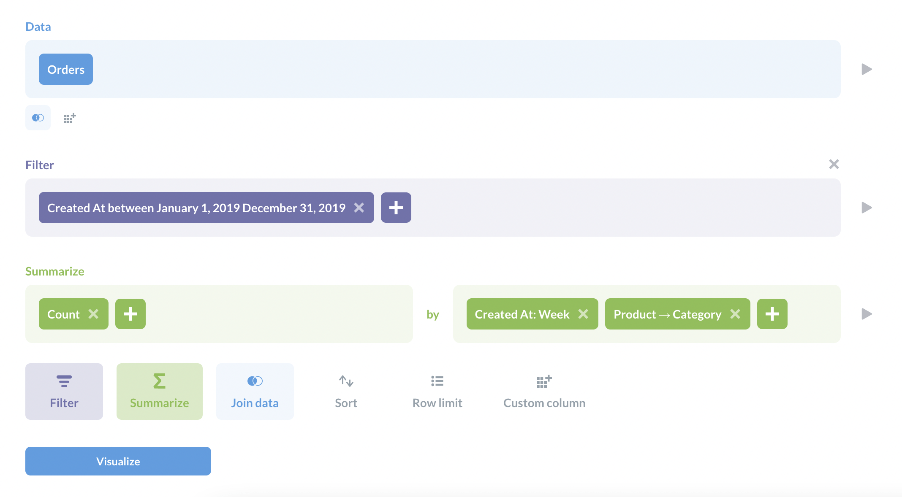

因为工作的关系，必须学习使用 Metabase，所以，开辟此文，记录一些我的学习笔记。

<!-- more -->

其实，早些年前，我用过一次 Metabase，并带领团队在公司内部搭建了一次这个系统。当时，我需要一个业务人员自己能够使用的 BI 系统，而且，出于 ROI 考量，不能一开始就下决心购买商业系统，其实我当时已经知道的比较强大的国内商业系统有帆软这样的，国外的有微软 PowerBI，Tableau 等等。而不想花钱的话，选择就比较少，此前了解的有 Metabase，SuperSet，Redash 等。这里不涉及[选型的考量](https://blog.csdn.net/weixin_43329319/article/details/108441435)，后面就开始记录一些 Metabase 相关的信息。

## 什么是 Metabase

Metabase 是一个**开源**的 BI 工具，它允许通过“提问”（Question）的方式，来查询数据，然后将查询结果以图表的形式展示出来。Metabase 本身是一个 Web 应用，可以通过浏览器访问，也可以通过手机 App 访问。

值得一提的是，Metabase 创建的图、表，是可以嵌入到其他 Web 系统的，对于纯后台的研发团队来说，如果去实现一些统计曲线比较麻烦的话，可以考虑使用 Metabase 创建嵌入式图表嵌入到自己的系统，在美观度和交互性上，都有不错的效果，学习、开发成本很小。

数据源方面，支持业务常用的各种数据库，比如 MySQL，PostgreSQL，Oracle，SQL Server 等等，还支持一些 NoSQL 数据库，比如 MongoDB，Redis 等等，还支持一些云服务商的数据源，比如 AWS Redshift，Google BigQuery 等等。

## 基础概念

### 导航侧边栏

 * **Home** - 首页，超链接，点击回到首页；
 * **Collections** - 集合，这里存储着你的“问题 Questions”，“仪表板 Dashborads”，“模型 Models”，这些我理解就相当于此系统提供的一些抽象概念，后面再继续展开。这个空间被分成两部分，“我们的分析 Our analytics”，这里存储着系统里公用的数据对象（即前面提到的三种）；另一个部分叫“你的个人集合 Your personal collection”，里面存储着你正在开发的数据对象，暂时还没有分享给系统其他用户。注：我理解，可以简单地认为 Collection 就是一个文件夹，也没什么不可。
 * **Data** - 数据，这里罗列着系统连接的所有数据源。
 * **Bookmarks** - 书签，你可以把你常用的一些数据对象保存在书签里，就会出现在这个区域里。

### 问题 Question

Metabase 里，Question，中文可能翻译成“问题”，是一个集合，包含了：一个查询、查询结果的数据、数据的可视化，三种合并在一起，称为一个 Question。

Question 这个对象还拥有标题，ID 和唯一的 URL，方便分享。

可以基于一个 Model，一张原始表，以及另一个 Question 去创建一个新的 Question。

注：就我个人理解来说，Question 其实就是一种查询，只不过，其过程是可视化的，用户通过鼠标点击来进行查询，首先框定数据的范围（选择表），然后，设定过滤器（Filter），最后进行聚合（Summerize），然后得到想要的结果，结果可能是一个标量（Metric），也可能是图表（二维），或者网格Grid（高维）。

### 过滤器 Filter

过滤器是一个用来限定数据范围的条件，可以是一个简单的等于，也可以是一个复杂的表达式，比如：`[年龄] > 18`。

注：可以理解成是写 SQL 时候的条件语句。

### 片段 Segment

片段是一个过滤器的集合，可以只包含一个 Filter，也可以包含多个 Filter，并且这种过滤行为被取了名字保存下来，以便下次再研究数据的时候，直接调用。

注：简单点解释的话，就是固化下来的查询条件，或者是可复用的查询条件。

### 模型 Model

导入到 Metabase 的数据，可能是很混乱的，比如字段的定义或者命名不是那么明确。也可能不是混乱的，但是导入的数据是为了进行线上的事务而高度优化的，反而不那么利于分析。

所以，作为 Metabase 的开发或者管理人员，为了方便其他人理解和复用数据，可以对数据进行重命名，数据类型的标定，甚至合并一些数据，产生一些经过计算才能得到的数据列。通过以上操作，可以其他人更好地理解数据，并且利用这些数据进行“提问”（Question），或者查询。这些操作后得到的产物，就是 Model。

注：可以理解成一般数据库里的视图（View）。持久化保存下来的 Question，也可以在其基础上创建新的 Question，所以，其本质也是一种 Model。

### X光 X-Ray

查看数据时候，在数据表右上角，点击闪电小图标，会触发一个数据探索，这个功能叫 X-Ray，有一些系统预置的 Question，帮助用户快速了解这份数据的面貌和质量。

### 指标 Metric

Metric 是一份数据的量化的属性。注：我理解，其实 Metric 其实就是我们常说的标量。基于数据进行的一种聚合统计值。

## 使用方法

关于如何使用 Metabase，我有一些设想，当然这里是我的一个计划，不是一个记录或者教程。

### 1. 作为数据的输出

一些需要与其他团队，角色共享的数据，可以输出到 Metabase，在自己的业务系统，对事务数据进行降维，制作成精心设计的宽表之类的数据，然后输出到 Metabase，利用其基本的数据研究能力，可视化能力，还有交互能力，创建可以访问的对象，然后利用 Metabase 的权限控制能力，分享给其他团队。

### 2. 作为数据可视化的工具

我所在的团队是后台开发团队，开发图表，Grid 之类的，即重复又低效，如果可以将数据导入 Metabase，创建完交互式可视化报表，再 Embed 进原来的业务系统，应该可以提高原系统的用户体验，同时也兼顾的开发效率。

## 缺点

目前，我看 Metabase 只支持 LDAP 和 Google 登录，这就对用户管理带来很大的不便，不能正确同步我们自己的用户体系。那么新用户注册也好，离职的同事注销也好，根据组织架构进行赋权也好，都变成非常麻烦的操作。

数据清洗和查询的能力还是不太够用的，一些复杂的数据处理和配置，还是不太够用的，若底层数据质量如果一般的话，在 Metabase 里很难开展清洗。只能是在原系统准备好高质量数据，后续才能玩得下去。
