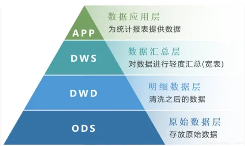

在高度系统化驱动的业务中，查看业务报表已经是一个很常见的需求了。在分工非常明确的大型企业里，往往有专门的数据分析团队或者数据开发团队，他们能够胜任此类需求（但也未必是轻松的，或者说高效的）。

但是，在都是业务开发的中小团队中，业务报表需求，往往就是业务系统的程序员自己进行开发。我不知道这种情况有多普遍，至少在我自己的团队是这样的。业务系统的设计往往是为了实现更强一致性，更高效率，而设计数据库的数据结构，在这基础上进行报表开发，往往会写出非常复杂的 SQL。

而不同角色的管理者要求的不同分析视角，使得报表的复用性无法达到理想的程度。开发繁复的报表统计需求，成为了程序员一个无法避免的负担。而在一个“管理信息”集中的系统里，这种矛盾变得尤为凸显。不光是实现这样的需求变得困难和不堪重负，仅仅是保持实现的正确性和高效性，都变得极为困难。

引入大宽表，可以有效降低开发的难度，以及提升代码的复用性。

<!--more-->

## 什么是大宽表？

大宽表，顾名思义是一种由单一 key 聚合起来的大量的相关列数据。举个简单的例子，以用户的 ID 为 key，把跟用户相关的所有字段，全部提取出来放到一个单一的表里，每个字段一列，这种就是一个大宽表。

大宽表，我相信这个概念在数据仓库里非常普遍，我也就借由数据仓库的一些基本概念来阐述大宽表的概念。
### 数据仓库

数据仓库的概念就像表面上的意思，是数据的仓库。不那么显然的是，数据仓库的存在，往往是为了数据分析的需要，也就是我们常说的 OLAP。而业务生产系统往往是为了事务的需求，也就是我们常说的 OLTP 系统，这恐怕也是相对于数据仓库来说的。

将数据从多种不同的业务系统提取，并进行整理后，产生以适应多维度分析的数据结构和格式，是数据仓库这个关键性系统的重要任务之一。

我两度经手管理跟大数据有关的团队，都会看到一个经典的结构图，关于数据仓库的一般性架构的：

每次我看到图的时候都是一头雾水的，ODS（Operational Data Store），DWD（Data Warehouse Detail），DWS（Data Warehouse Summary），DM（Data Market/ Marts），ADS（Application Data Service）等等，我根本不知道什么意思。括号里写的一些缩写，也只是我网上随便找的，未必就是精确的，至少每个大数据开发，架构师都一套振振有词，虽然他们也未必能说清楚缩写的真实含义。

回来，不管数据仓库到底是什么意思，但是都透露出一个基本的思想，就是业务数据需要经过整理和规范化处理，然后，形成按照特定主题聚合的“成品”数据，方便分析应用更好的使用。
### 无奈的选择

如果你所在的公司，有一个建制完善的大数据开发团队和对应的数据分析团队，那么恭喜你，你可以从这类的任务中摆脱出来，专注于业务逻辑的开发。否则，应对各种各样的报表需求，也是你不得不接受的任务。

大数据的架构看似美好，但是就跟 OSI 的网络七层模型一样，这是理论中完美，在实操过程中，要应对各式各样的挑战。这也就是我在文章开头说的，即便对于专业的大数据开发团队来说，实现数仓的架构既不是轻松的，也不是高效的。

不过，我在实际业务执行过程中体会到，数据仓库的思想是非常先进的，也有很多的可取之处。比如，根据一个用户的 ID，就可以提取到有关此用户单个人的所有统计信息，然今后再进行简单的聚合，就可以计算出各种想要的分析维度，这难道不美好么？与之相对的，你可能要在系统里联表七八张，然后用复杂的过滤条件，再用复杂的 Group By，最后得到的数据，还需要在代码层再次进行运算，才能得到结果。

数据仓库的数据分层清洗汇总的思想，将很多复杂的运算，在计算层次上进行了抽象和分离，最终实现了计算和统计分离，是一种高效的解耦思想。

我们的所有统计分析在一条复杂 SQL 中出来，这种反倒是将所有东西杂糅在一段代码里进行处理，一个是不方便复用（只能拷贝过去改改），另一个就是不方便调试（很难阅读，也很难比较）。

但是我们又没有足够的人力去把整个数据仓库做出来，形成一个四层结构的 DW。那么这时候，大宽表，就是我们妥协后的一个很好选择，也会成为未来数据仓库构建的一个良好基础。

## 如何设计大宽表

大宽表，实质上，就是一个结构复杂的业务数据表集合，根据单一 key 在二维上一种展开格式。举个例子，用户大宽表，包含 ID，姓名，账号，注册日期，订单数，消费次数，消费总金额，消费平均间隔，消费最高的五个品类，消费的价格区间，等等等各种简单但并不平凡的字段构成。

有了这张宽表，我们可以分析用户的消费能力，消费习惯，活跃程度，流失概率等等各种报表。

### 归纳法

你的团队应对单个分析需求的时候，往往不会想到要去做个大宽表，因为单个分析需求来的时候，业务往往刚刚起量，我们不可能遇见未来的发展趋势，一般都是直接帮需求方实现了。

但是当类似的需求越来越多的时候，就要警醒，可能业务已经进入腾飞的态势，未来此类分析会越来越多，越来越频繁，而我们需要提供精度越来越高的数据。

这时候，将已经收到并实现过的统计分析需求，进行汇总观察，提炼一个主要的分析 key，并形成宽表设计，就是一个明智的选择。这种方法，我称为归纳法。

### 字段遴选

哪些字段进入大宽表，哪些不要，这是一个艰难的选择题，我们业务团队自行研发宽表，本来就是一个不得已的选择，意味着我们开发的资源非常有限。不可能无限实现各种字段。

那些明显能够支撑统计需求的字段，必然纳入我们的选择，哪怕是冗余的。这些统计字段都会降低后期分析报表出具的难度。但是有些变化不那么频繁的字段，也可以继续保留主键，而不对值进行展开，这就意味着后期分析的时候，仍然需要联表查询，在数据仓库中，这种往往叫维度表，但是哪些字段可以作为维度表，并不是表面上那么明显，经常是艰难的抉择，这就需要长期业务开发积累的经验。

## 缺点和困难

说了很多优点，缺点和难点却不得不提。

比如，一致性和延迟就是一个最大的问题。客户是不会容忍你，多少分钟同步一次的。他们只觉得，我在系统里改了数据，我的统计值为什么不变？解决这个问题，就要做好事先需求的沟通和用户教育，对用户做出延迟承诺，比如，XX数据，在变更后，至多 10 分钟完成各种环境的同步，这就是一种服务承诺。通过这样的方法，在用户心中建立合理的预期。

第二，宽表构建的依赖和调度的复杂度。比如宽表里的字段，有些在构建时期，就是通过多个关系表，关联起来以后综合计算或者说判断的，在宽表里表达很简单，只是一个字段而已，但是计算过程可能就比较麻烦，有着前后依赖。我举个例子，比如我们用的一个金额列，必须先计算当地支付金额，然后在这个基础上，查询货币兑换的比值（需要用币种和发生时间查表得到），进行外币折算后，才能成为一个有效的金额字段。在进行此类字段的构建时，就出现了依赖的问题，我先要构建第一个字段，然后查询其汇率，才能构建第二个字段。构建时候需要先计算原始币种，发生时间，然后下一步骤才能计算折算金额，有前后依赖问题。

另一个自然想到的问题，是一旦业务数据库发生了变化，这种前后依赖的数据计算，还需要被及时和顺序地调度，这就引发了需要一个强大的依赖管理和任务调度系统。才能有效实现数据宽表的及时更新。

