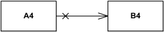

学习 UML 的历史可以追溯到 2003 年，即便在当年也不是什么新鲜技术。不过，我觉得，即便今天我也不敢说，我真的很懂 UML 了。

不过，如果想学习面相对象技术，比如 OOA——面向对象分析，OOD——面向对象设计，你就不可能绕开 UML 语言。除非你永远都是单打独斗，只编写规模很小的软件，而且从不依赖别人写的复杂软件库。要知道，在软件构建这个领域，这几乎是不可能的。

<!--more-->

UML 全称是统一建模语言，我知道很多人从没有系统学习过，就好比我自己。而且最巧妙的是，就算如此，也不妨碍你使用它来表达、记录自己的思想。你甚至产生一种错觉，这工具就是一种不言自明的东西，根本没必要学习。

其实，这道理就好像母语一样，我相信很多人从小学毕业后，再没认真学习过语文了。不就是说话写文章么？这还用得着学？就算不学我就不能说话和写文章了？显然不是。只是，如果你想更精确地表达自己的意思，传递信息，或者从别人传递的信息中接受到更精确和细微的部分，你就不得不学习和训练。

你当然可以放弃这一部分，因为，每说一句话，看一篇文章，写一篇文章，你损失的精度是有限的，边际损失为 0。只是天长日久下来，会妨碍你学习、表达的精度而已。而这对大多数人是没有什么损、益的。

## 类图

这篇笔记，可能只有这一个章节，因为我用得最多的就是类图，帮助我分析一个类库，以及表达自己的设计。有时候，业务系统的领域模型，我也喜欢用类图来表达。另一种我最爱的图，你们一定猜不到，是“用例图”。后面有精力再说吧。

类图里，表达一个类的图示，是非常简单的，就是一个矩形。分成三栏，第一栏是类名，第二栏是属性，第三栏是方法。

类图里，我真正搞不清，记不住的是各种修饰副号和错综复杂的关系。多数情况下，你不会只画一个孤立的类，一定会画一群类，这些类对象被构建出来后，协同工作来完成你的业务。

如何表达类与类，对象与对象之间的关系，就变得十分重要了。

### Association 关联

**关联**是一种类与类之间的关系，它表示类的实例之间是互相连接的，或者逻辑上组合在一起的，或者是物理上聚合的。

这种关系可以被应用在很多种 UML 图中，不光是类图。其表达一般会被画成一根线。如果你没学习过更多的关系线种类，你一般天然画出来的就是这种线。

我理解，这是一种抽象的关系，没有精确表达两个类实例到底是什么具体的关系，将两个类连接起来，就至少代表这两者一定**有关**，严格区别于这两者无关的情况。但是关联的种类是不明的，一定有某种程度的依赖，但是方向不明，可能存在耦合。

总体来说，这是一种抽象的关系。

此关系的线条画法，有一些变体：

如上面的图里，代表从A4，可以访问到B4，但是反过来不行。这叫做可导航性，而本质上，代表了一种依赖的单向性。

### Aggregation 聚合

**聚合**是一种二元的关联关系，它一般表示的是一个类对象的属性和其他对象的关系。一般聚合都是偏序的，只有在关系线条的一侧是聚合，另一侧不是。

这种关系一般是共享的，怎么理解共享呢？比如，你是你小组的组员，同时，你也是你公司的员工，这两种关系并不矛盾。如果你的小组解散了，或者你的公司倒闭了，并不影响你的存在性，你还是你，但是小组和公司都不复存在了。

上图是一个聚合的例子，“三角形”由 3 条“线段”聚合而成。
### Composition 组合

**组合**是一种二元关系，可以理解成一种更强的“聚合”，它经常表达的是“整体”和“部分”的关系。一个“部分”最多只能属于一个组合体，一旦这个组合体销毁了，我们默认其所有组成部分也都销毁了。

如上图所示，一所医院，由若干科室组成，每个科室有且仅有一个，一旦医院不存在了，科室也不能脱离医院独立存在，只有在一所医院里，科室才具有意义。
### Generalization 泛化

**泛化**是一种二元关系，它是一种有向的偏序关系，连接两个实体，一个比另一个更通用，更抽象。一般来说，我们在 UML 图里，用此表达父类和子类的关系。

父类其实是子类的一种泛化。而子类是父类的特化。

上面是一个泛化的关系的例子。可以这样聚合在一起画。能明显看出来父类和子类的关系。
### Dependency 依赖

**依赖**是一种直接的关系，表示一些元素，需要或者依赖另一些元素（因为其特定用途或者实现）。这种关系也被称为是“供应商--客户”关系。供应商给客户提供一些服务，而客户在一定程度上依赖供应商，如果供应商发生了一些变化，可能影响到客户。

 依赖的线条画法，是一条虚线。从上图里看，依赖有大概三种类型。使用，抽象，部署。可以双尖括号符号来标记不同的类型的关系。

上面是一个依赖的例子，一个 CarFactory 实例化一个 Car 对象，也就是一个典型的工厂模式。
## 用例图

用例图通常被称为行为图，用于描述一组操作（用例），某个系统或多个外部系统（主体）应或可以与系统的一个或多个外部用户（操作者）协同执行的操作。每个用例应为操作者或系统其他相关方提供一些可观察和有价值的结果。  
  
请注意，UML 2.0到2.4规范也将用例图描述为类图的一种专门化，而类图是一种结构图。  
  
实际上，用例图是双重的 - 它们既是行为图，因为它们描述系统的行为，也是结构图 - 作为类图的一种特殊情况，其中分类器被限制为关联的操作者或用例。

上面是一个用例图的例子。这图里解释了三个不同的角色可以执行的几种业务。

用例图提供的这种视角，正式我非常喜欢它的原因。多年来的软件设计和实现，让我得到一个经验，就是如何进行系统设计。

一般来说，你首先需要对领域模型进行提取和精炼，然后设计对象体系来分解你的任务。用例图应该在一开始就画出来，以及在设计基本成型后，再次拿出来。

一开始拿出来，是因为你要用这个图去分解业务流程，指导后续的领域和类模型设计。而最后拿出来，是为了推导和验证业务的可实现性。例如：基于现在已经完成的设计，我图里画的这种业务要怎么实现？更新那些实体？满足怎样的顺序？有否冲突？性能如何？

通过核心业务的推演，你才能确定现在拿出来一套基本可行的设计。而不是实现到一半，突然发现不行，然后抹掉重写，那抹掉后，你重写的时候，会关注那些已经可以正常执行的业务，和未来即将实现的业务么？

在用例图指导下的业务推演，可以帮助你避免顾此失彼。
## 总结

这个[网站](https://www.uml-diagrams.org/)，提供了很多关于每种图形的文档。我就是在这里进行学习和结合自己的理解记录笔记。每当需要的时候，可以来这里补课一番。

