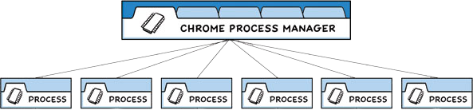
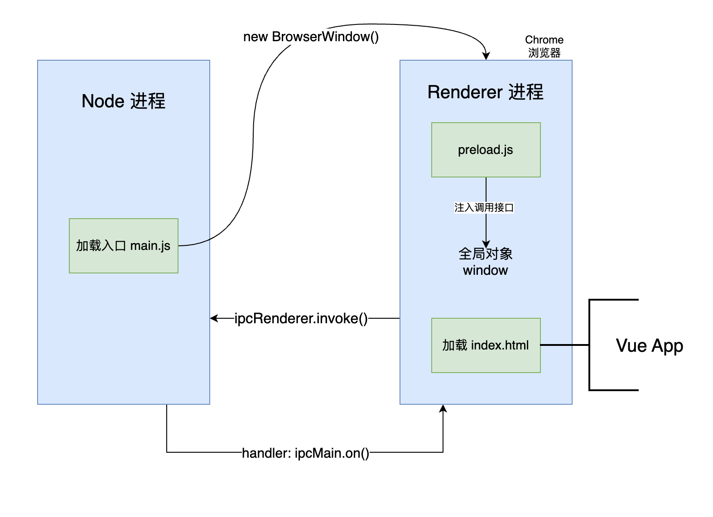

我有一个 Side Project 使用了 Electron 框架，通过这个项目，我接触并积累了一些 Electron 相关的知识，足够我构建一个 **博客管理桌面客户端** 软件。

在项目结束了前期密集开发期，逐件进入稳定后，我的维护频率降低了，并且，这些维护工作，更多集中在 Web 开发的范畴内，主要是 Vue 应用的开发。

但总有一些时候，我不得不重新处理一些跟 Electron 有关的工作，而每当这种时候，我都想不起来 Electron 框架开发技术的一些关键点，以至于我陷入了总是要重新学习这些知识点的窘境。

我撰写并维护这篇文档，是为了一次又一次从“零”教会我自己，关于 Elctron 必须知道的一切知识。

<!--more-->

## 什么是 Electron？

> Electron 是一个框架，使开发者能够将 Web 技术(HTML、JavaScript、CSS)、Node.js 及原生代码相结合，构建适用于 macOS、Windows 和 Linux 的跨平台桌面应用程序。 它基于MIT开源许可证，对商业和个人用途均免费。—— [官网](https://www.electronjs.org/zh/docs/latest/why-electon) 

我觉得 Electron 的最大价值在于，让一个 **只懂得 Web 开发技术的工程师，可以构建跨平台的客户端软件**。真正的一次开发，在多平台分发，虽然交叉编译支持得比较烂（我无法在我的 M1 芯片 MacbookPro 上面编译 Win 64 版本的客户端软件）。

当然，可能还有一个 **更为常见的用途**，就是将一个 B/S 架构的系统，改成 C/S 架构，只要将网页端的代码，用 Electron 封装成客户端，然后分发给客户即可。但我并没有这么做过。

## 核心原理

Electron 的核心原理，是将 **Chromium** 和 **Node.js** 整合到了同一运行时环境中，其中，Chrome 提供了跨平台的界面渲染能力，保证了不同平台上**表现层**的统一，而 Node.js 提供了跨平台的**系统级调用**，提供了文件系统、进程管理、计算机网络等方面的系统能力。

而且，这两者底层都使用 Javascript 作为开发语言，为桌面端开发提供了海量可复用的库代码。极大降低了桌面端开发的成本。

但是，这种原理也决定了，其性能受限于 Node.js 和 Chrome 的性能，打出来的包，体积也比较惊人，必须在一个应用的包内，同时包含 Node 和 Chrome 的全部运行时环境，必然不会太小。

不过，在多数场景下，框架的易学程度、发布速度，都是相对更为重要的指标，包体大一点，倒不是问题。

## 基础知识

那么 Electron 是怎么做到将 Node 和 Chrome 整合到同一个运行时的呢？这就要介绍一个 Electron 应用的基本结构了。

### 进程模型

Chrome 采用了多进程的结构，每个浏览器标签都是一个独立进程。

而在 Electron 中有一个 main 进程，相当于 Chrome 的管理进程，而 renderer 进程则加载 Web 技术实现的 UI 界面。

上面的图，是一个基本的 Electron 的进程模型，可以见到，一个 Electron 应用是由两个重要的进程组成（可能还有别的），一个是 Node 的运行环境，也是主进程，另一个是 Chrome 的运行环境，是有 Node 主进程 fork 出来的。

### 基本的应用构成

一个 Electron 应用有至少四个文件构成，每个文件都扮演一个关键角色。

- `main.js` 是整个程序的入口文件，通过 `package.js` 配置指定，主进程加载后，会构造一个 `BrowserWindow` 的实例对象，来作为加载 UI 界面的浏览器窗口。 在 `main.js` 中开放了 Electron 提供的各种系统 API，以及可以在这里操作 Node.js 的各种模块。
- `index.html` 作为 Electron 的 Web UI 部分的入口文件。
- `renderer.js` 通过 `index.html` 引入此文件，这就相当于一个普通网站的 js 文件。
- `preload.js` 因为 Electron 是 Node 和 Chrome 两种架构的整合，但是两种

### 每个进程的作用

应用启动后，首先是启动一个主进程，这是一个 Node 进程，会加载并执行 `main.js` 脚本，也就是你整个 App 的主进程文件。

然后在 `main.js` 里面，我们会调用 `new BrowserWindow()`，会创建一个浏览器进程，也就是 Chrome，里面会加载 `index.html` 文件，其实到这里，整个 Electron 应用的基本原理已经实现了。

在 index.html 里面，我可以加载一个 Vue 的应用，比如用 `<script>` 标签来加载一个 `app.vue` 入口文件，整个 Vue 的 App 就加载了。

浏览器进程，在 Electron 里叫做 renderer，也就是渲染器的意思。上面已经解释了，渲染器主要就是负责软件的界面渲染的，通过网页技术实现，想象成一个功能完备的浏览器就可以了，入口文件是 index.html。

两个进程都有了，那么怎么通信呢？

### 预加载脚本 preload

为了安全考虑，网页里的 js 不能和 NodeJS 的主进程直接通信，在新版的 Electron 12+ 里，实现了一个叫**上下文隔离**的安全机制。

这是为了安全考量。因为 Node 进程有系统调用的权限，而 Chrome 里能加载一些网上下载的脚本，如果不注意，可能危害到用户的系统安全。所以默认开启上下文隔离特性。只建议渲染器和主进程，进行进程间通信，使用 IPC 通信技术。

解决方案是，main 进程在创建 BrowserWindow 的时候，允许注入一个 preload 脚本，允许运行少量的 NodeJS 的 API，目的是为了打通 main 进程和 renderer 进程通信的通道。

在 renderer 进程中，注册一些对 ipcRenderer 的消息发送，或者消息接受的 handler，然后到时候使用消息来和 node 进程通信。

同理，在 main 进程中，也要注册一些对 ipcMain 的消息发送，和消息接受的 handler，实现将**界面**与**后台逻辑**贯通。

### 构建

构建一个完整的 Electron 应用，分为基本部分，

一个是对 Web 侧的构建，比如我们使用 Vue 或者 React 开发框架，所以，首先需要对 Web 侧进行构建，这个构建完了，只是实现了一个让浏览器可以加载的界面端。

第二个是对 main 进程的构建，如果你有一个复杂的 Node 应用，有很多代码和逻辑，那么就也需要构建成一个独立的后台应用。

### 打包

就是要将构建好的 main 和 web 的代码，都打包到一起。

使用 electron-forge 作为打包工具，这是官方推荐的工具，当然还有很多别的工具。

可以使用 vite 作为 electron-forge 的后端，vite 是对 ts 或者 web 代码进行构建的工具，而 electron-forge 还要负责打包和整合两者。

构建工具要处理好依赖的问题。

比如 node 应用依赖哪些，要打包进去，而 web 应用依赖哪些，也要打包进去。

交叉编译的问题，需要在电脑上安装对应环境的依赖，我试过在 M1 的 MBP 上去打包 M1 Mac 系统的包，以及 Intel 系统的包，都没有问题。但是在我尝试去打包 Win 64 系统的包的时候，出现了问题。就是同时依赖 wine 和 mono，而 wine 的运行又依赖 rosseta，当我所有的都装好后，发现还是不能正确构建。

所以我放弃了。

## 范例

使用 electron 的实际开发体验是非常好的。具体如何从 0 开始一个 electron 应用的构建，可以见我以前发表的一篇博客文章。

