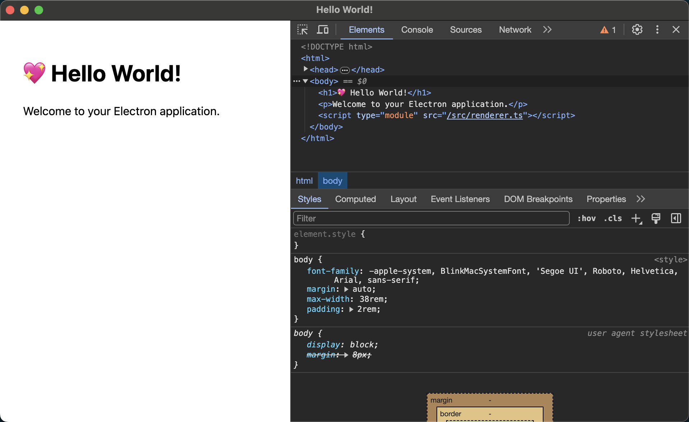

## 简介

Electron 是一个开源的跨平台桌面应用程序开发框架，它允许开发者使用 Web 技术（如 JavaScript、HTML 和 CSS）来构建桌面应用程序。Electron 嵌入了 Chromium（一个开源的 Web 浏览器引擎）和 Node.js（一个运行在服务器端的 JavaScript 运行时环境），使得开发者能够创建既具有现代 Web 应用的丰富交互性，又具备传统桌面应用的功能和性能的应用程序。

程序员每天离不开的 Visual Studio Code，以及团队协作软件 Slack，聊天社区 Discord 的客户端，都是用 Electron 开发的，可能打出来的包会比较大，但是框架周边成熟度，兼容性和开发体验是真的很棒。仍然是现在桌面端跨平台开发的首选技术之一。最近，我就利用 Electron 技术开发了一个博客客户端软件 [HexoPress](https://github.com/charlestang/HexoPress)，开源在 GitHub。从 0 开始学习并完整体验了 Electron 开发的各个方面。

本文给大家分享，2024 年，如何从 0 开始创建一个 Electron 项目。

<!--more-->

## 准备工作

首先你需要一个开发环境，我会使用 Mac 作为例子，如果你使用的是 Windows，我建议通过虚拟机安装 Linux，会跟在 Mac 下差不多的体验，但是在 Windows 上，会有很多意外小麻烦。

开始之前，你首先需要安装 Node.js 的开发环境，在 Mac 就是：

```shell
brew install node
```

或者，你可以使用 `nvm` 来管理电脑上安装的 node 环境的多个版本。本文就不介绍了。`npm` 也是一个必须的工具，不过安装好 node，会自动就安装了 npm。

你可以登录 Electron 的官网，在文档页面，会看到一些指引。官方文档的“快速开始”，可以仔细阅读一下，这个文档重点介绍了 Electron 项目启动的最小规模，需要四个重要文件，`main.js`，`preload.js`，`renderer.js`，`index.html`，官方文档会介绍这四个文件的作用，以及引导开发者，从 0 手动创建一个项目脚手架。此外提供了一个示范项目，在 GitHub 搜索 `electron/electron-quick-start` 可以找到。

官方还提供一个类似 Playground 的地方，供每个开发者实验自己的想法，叫 Electron Fiddle，是一个客户端软件，会把刚才的那四个文件组装成一个临时的 Electron App，供开发者尝试。也是不错的上手方式。

## 快速开始

如果，你去阅读文档，然后搞清楚所有原理，并手动创建了项目，那么就不能称为是“快速开始”了。真正比较快速的方式是，通过项目的模板来快速构建一个项目脚手架。而官方实际上也提供了这样的项目模板，但是我不明白，为什么官方文档把这个放在那么深的入口，非常不易找到。

这个项目的模板，其实是官方的打包工具 Electron [Forge](https://www.electronforge.io/) 提供的，下面介绍怎么使用这个模板。

```shell
npm init electron-app@latest my-first-electron-app -- --template=vite-typescript
```

这个命令是用来创建一个新的 Electron 应用的。这里是它的各个部分的详细解释：

- `npm init`: 这是一个 npm 命令，用于初始化一个新的 Node.js 项目。它会创建一个新的 package.json 文件，这个文件包含了项目的元数据和依赖信息。
- `electron-app@latest`: 这是一个 npm 包的名称和版本。electron-app 是一个用于创建 Electron 应用的模板，@latest 表示我们想要使用的是这个包的最新版本。
- `my-first-electron-app`: 这是新项目的名称。这个命令会在当前目录下创建一个名为 my-first-electron-app 的新目录，并在这个目录中初始化新的 Electron 项目。
- `--`: 这个符号是用来分隔命令和选项的。在这个符号之后的所有内容都会被视为选项，而不是命令的一部分。
- `--template=vite-typescript`: 这是一个选项，用于指定我们想要使用的项目模板。在这个例子中，我们选择的是 vite-typescript 模板，这是一个使用 Vite 和 TypeScript 的 Electron 项目模板。这里还有一些选项，比如 `webpack`，比如 `vite`，区别是没有 typescript。不过既然大家都选择看本文来学习的话，我推荐学学 typescript，因为是适合构建大型项目的技术，如果怕麻烦，可以不选 ts，因为真的有一点点麻烦，在前期容易造成学习的障碍。

所以，整个命令的意思是：使用 electron-app 包的最新版本，初始化一个名为 my-first-electron-app 的新 Electron 项目，并使用 vite-typescript 模板。

顺利的话，现在你已经初始化了一个项目的脚手架。如果不顺利的话，比如我，就碰到了一些问题。比如，这个工程中调用了 yarn，就出现了报错。

```text
  ✖ Failed to install modules: ["@electron-forge/plugin-vite@^7.2.0","@typescript-eslint/eslint-plugin@^5.0.0","@typescript-eslint/parser@^5.0.0","eslint@^8.0.1","…
    With output: Command failed with a non-zero return code (1):
    yarn add @electron-forge/plugin-vite@^7.2.0 @typescript-eslint/eslint-plugin@^5.0.0 @typescript-eslint/parser@^5.0.0 eslint@^8.0.1 eslint-plugin-import@^2.25.0…
    yarn add v1.22.21
    info No lockfile found.
    [1/4] Resolving packages...
    info Visit https://yarnpkg.com/en/docs/cli/add for documentation about this command.
    (node:89705) [DEP0040] DeprecationWarning: The `punycode` module is deprecated. Please use a userland alternative instead.
    (Use `node --trace-deprecation ...` to show where the warning was created)
    error Error: certificate has expired
    at TLSSocket.onConnectSecure (node:_tls_wrap:1674:34)
    at TLSSocket.emit (node:events:515:28)
    at TLSSocket._finishInit (node:_tls_wrap:1085:8)
    at ssl.onhandshakedone (node:_tls_wrap:871:12)
    (node:89705) [DEP0040] DeprecationWarning: The `punycode` module is deprecated. Please use a userland alternative instead.
    (Use `node --trace-deprecation ...` to show where the warning was created)
    error Error: certificate has expired
    at TLSSocket.onConnectSecure (node:_tls_wrap:1674:34)
    at TLSSocket.emit (node:events:515:28)
    at TLSSocket._finishInit (node:_tls_wrap:1085:8)
    at ssl.onhandshakedone (node:_tls_wrap:871:12)
  ⚠ Finalizing dependencies
```

真是糟糕的体验，具体错误是中间的一行 `error Error: certificate has expired`。解决办法是，可以把对 SSL 的校验给关闭。

```shell
yarn config set "strict-ssl" false -g  #关闭检查
yarn config list                       #显示所有配置，检查确认
```

再次执行刚才的 init 试试。这次我们看到项目初始化成功了。

**UPDATE**：这里给大家认个错，**上面的解决方法是错误的。虽然也能绕开问题往下走，但是，是一种很坏的习惯。** 请看 [这篇文章](/2024/why-certificate-error-using-npm/) ，详细解释了原因。正确解决方法是，检查自己是否使用了过期的 registry 镜像，更换为有效的镜像 [https://registry.npmmirror.com](https://registry.npmmirror.com) 或者官方镜像 [https://registry.npmjs.org/](https://registry.npmjs.org/) 。或者检查系统的代理配置，根证书配置等。

进入到项目目录，执行：

```shell
yarn start
```

你的第一个 Electron App 启动了！！





现在你可以仔细看看你的目录结构了，这个 vite-typescript 的模版，特点是全部使用 ts，如果用 js 的话，文件组织形式会有不同，不过我个人很喜欢 ts，会让目录看起来更简洁一点，后续我会介绍更多的细节的点，比如我要用 vue 3 + typescript 来开发 App，如果 Electron 的部分是 js 的，而 vue 3 是 ts，就很不符合我的审美。

比如大家可以看看我现在的那个项目 HexoPress，前面有链接，就是这种混搭，让我极其不爽。
