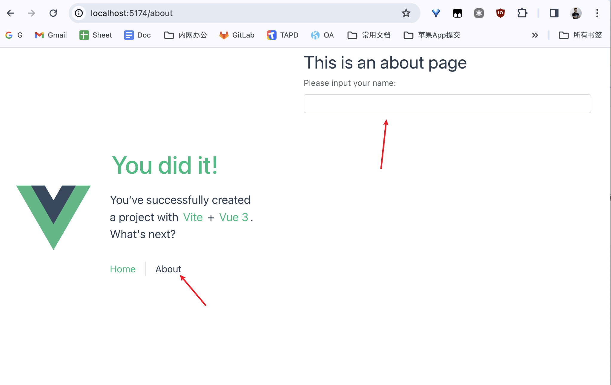

此前，已经写文章介绍了[如何从 0 开始创建 Vue 项目](https://blog.charlestang.org/2024/howto-learn-vue-from-zero/)，今天我们来说说，怎么在 Vue 项目中引入 Element Plus。

<!--more-->

## 简介

Element Plus 是一个基于 Vue 3.0 重构的桌面端组件库，它是 Element UI 的升级版，专门为适配 Vue 3 设计。Element UI 是一个基于 Vue 2 的组件库，而 Element Plus 则利用了 Vue 3 的新特性，如 Composition API 和 Teleport 等，以提供更好的开发体验和性能。

Element Plus 的主要特点包括：

* TypeScript 支持：Element Plus 使用 TypeScript 重写，提供了完整的类型定义文件，使得在 TypeScript 项目中使用更加方便。
* Composition API：利用 Vue 3 的 Composition API，Element Plus 降低了组件间的耦合度，简化了逻辑结构。
* Teleport 特性：Element Plus 使用 Vue 3 的 Teleport 特性来重构挂载类组件，提供了更灵活的组件挂载方式。
* 项目维护：Element Plus 使用 Lerna 进行项目管理，使得维护和更新更加高效。
* 依赖升级：Element Plus 升级了核心依赖，如 popper.js 和 async-validator，以保持与现代前端技术栈的兼容性。
* 国际化：Element Plus 支持多语言，方便不同语言环境下的开发。
* 迁移工具：为了帮助开发者从 Element UI 迁移到 Element Plus，官方提供了迁移工具和迁移指南。
* 兼容性：Element Plus 支持现代浏览器的最后两个版本，但不再支持 IE11，因为 Vue 3 本身也不再支持 IE11。

## 准备

使用 Element Plus 需要一些基础知识，包括但是不限于：

* Vue 3
* TypeScript
* 组件的基本知识

另外，你可能需要先搭建一个 Vue 3 的项目脚手架。

## 安装 Element Plus


上面是一个 Vue 3 项目的脚手架，我们首先引入对应的包。

开始之前，首先用 Git 提交当前的脚手架内容，出现问题，我们可以回滚。

```shell
cd my-fisrt-vue-app
git init
git add ./*
git commit -a -m "Init commit."
```
然后就可以放心大胆的引入 Element Plus 了。在项目根目录：

```shell
npm install element-plus --save
```

具体的引入方法可以参考官方的《[快速开始](https://element-plus.org/zh-CN/guide/quickstart.html)》，我们这里就挑其中一种介绍一下。

这里我想介绍的是按需导入，因为全部导入固然方便，但是实际使用的时候，我们总要优化一下资源大小的，还不如一开始就按需导入。

其实也可以手动一个一个导入，不过那样太麻烦了，还是用官方推荐的方法，在最低效和最优化中间取得一个平衡。

```shell
npm install -D unplugin-vue-components unplugin-auto-import
```

打开你的 vite.config.ts 文件：

```typescript
import { fileURLToPath, URL } from 'node:url'

import { defineConfig } from 'vite'
import vue from '@vitejs/plugin-vue'

// https://vitejs.dev/config/
export default defineConfig({
  plugins: [
    vue(),
  ],
  resolve: {
    alias: {
      '@': fileURLToPath(new URL('./src', import.meta.url))
    }
  }
})
```

修改为：

```typescript
import { fileURLToPath, URL } from 'node:url'

import { defineConfig } from 'vite'
import vue from '@vitejs/plugin-vue'

import AutoImport from 'unplugin-auto-import/vite'
import Components from 'unplugin-vue-components/vite'
import { ElementPlusResolver } from 'unplugin-vue-components/resolvers'


// https://vitejs.dev/config/
export default defineConfig({
  plugins: [
    vue(),
    AutoImport({
      resolvers: [ElementPlusResolver()],
    }),
    Components({
      resolvers: [ElementPlusResolver()],
    }),
  ],
  resolve: {
    alias: {
      '@': fileURLToPath(new URL('./src', import.meta.url))
    }
  }
})
```

现在我们如果执行 `npm run build` 应该没有报错的，执行 `npm run dev` 本地启动后， https://localhost/5173 页面上什么也不会看到。

## 快速上手

现在我们尝试来用一下 Element Plus，打开 Vue 3 的脚手架文件 `src/views/about.vue` ，我们会看到代码是这样的：

```typescript
<template>
  <div class="about">
    <h1>This is an about page</h1>
  </div>
</template>

<style>
@media (min-width: 1024px) {
  .about {
    min-height: 100vh;
    display: flex;
    align-items: center;
  }
}
</style>
```

页面里只有一个标题。我们在这里开始加入 Element Plus 的组件。改成：

```html
<template>
  <div class="about">
    <h1>This is an about page</h1>
    <el-form width="500px" label-position="top">
      <el-form-item label="Please input your name:">
        <el-input></el-input>
      </el-form-item>
    </el-form>
  </div>
</template>

<style>
@media (min-width: 1024px) {
  .about {
    min-height: 100vh;
    display: block;
    align-items: center;
  }
}
</style>
```

注意第 4-8 行和第 16 行，我们插入了 Element Plus 的组件，都是 `el` 开头的标签。关于这个标签的写法，Vue 官方也有一些建议，但不是强制的，也可以写成大写的，比如 `<ElForm>` 这样的。看团队要求和个人喜好了。



在浏览器上，我们点到 About 这个标签页，看到是这样的。

然后，我们写一点点小功能，来让它动起来。在上面的代码里，增加一个 `script`：

```typescript
<script lang="ts" setup>
import { ref } from "vue"

const name = ref("")
</script>
```

这样我们就创建了一个响应式变量。然后我们再增加一个按钮，点击按钮的时候，展示一句话：

```typescript
<script lang="ts" setup>
import { ref } from "vue"

const name = ref("")
</script>

<template>
  <div class="about">
    <h1>This is an about page</h1>
    <el-form width="500px" label-position="top">
      <el-form-item label="Please input your name:">
        <el-input v-model="name"></el-input>
      </el-form-item>
    </el-form>
    <p>Hello, {{ name }}!</p>
  </div>
</template>

<style>
@media (min-width: 1024px) {
  .about {
    min-height: 100vh;
    display: block;
    align-items: center;
  }
}
</style>
```

注意上面的第 12 行和 15 行。我们用 `v-model` 绑定了响应式变量 `name`，然后在第 15 行用 **两队大括号** 回显了这个变量。

然后我们可以看到，界面上，输入一个名字后，底下实时回显出来了，这就是 Vue 的双向绑定了。


## 自动导入

刚才我们已经完成了在 Vue 3 的项目中，从 0 导入了 Element Plus 这个 UI 库，并实现了一个简单的 demo。现在去观察一下我们的代码目录，我们会发现，多了两个文件，一个是`auto-imports.d.ts` 另一个是 `components.d.ts`，并且里面都有了一些内容。这就是我们刚才做的按需导入的结果了，Vite 会使用对应的 Plugin，自动导入我们在页面上引用的组件和对应的 CSS 文件。

所以，我们就像看起来那么轻松，直接在页面上用就对了。

事实上，还有一些工作需要去完成，才能解决一些依赖的问题，不过为了避免初学的时候分心，这里就不提了。

## 总结

本文介绍了，如何在一个 Vue 3 的脚手架项目中，从 0 引入 Element Plus 的 UI 库。后续的学习，主要是学习 Element Plus 的各个 UI 组件的用法。主要是布局组件，导航组件，表单组件等等类别。再就是在项目实现的过程中解决各种疑难杂症。

我的开源项目 HexoPress 就是使用 Element Plus，界面元素并不多，不复杂，感兴趣的同学可以去看看。