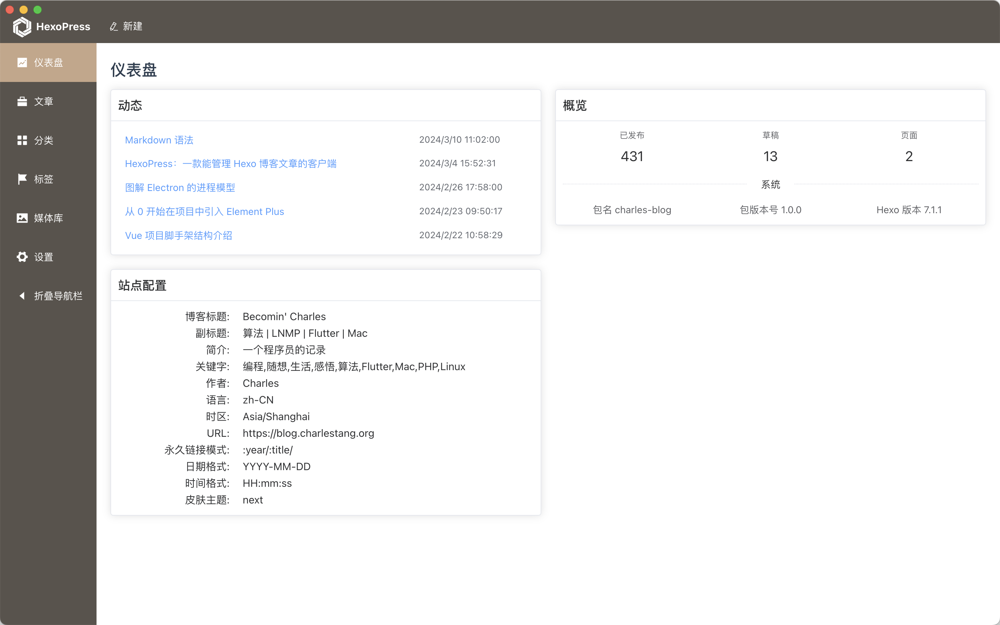

<!--more-->

# 一、缘起：为什么开发 HexoPress

去年，我将个人博客 —— [《 Becomin' Charles 》](https://blog.charlestang.org)，从阿里云香港服务器迁移到了 GitHub Pages 托管。这么做的好处是毋庸置疑的 —— 免费。但也不是只因为费用的原因，毕竟我依然租赁着服务器，是考虑到现在的解决方案可以在无人续费的情况下，尽可能长时间的运营下去，这一点比付费服务器更有优势。

GitHub Pages 服务，只支持静态内容的托管，所以，我的博客内容管理系统，从 WordPress 变成了 Hexo —— 一款静态站点生成器，主要应用于个人博客领域。

在 Hexo 的使用的过程中，我发现其设计理念，在内容管理方面不尽如人意。不能有机地管理文章的分类体系和标签。如果你的博客文章非常少，分类、标签也非常少，那可能感觉不到我的困扰。但如果文章稍微多一点，而且涉及到内容的整理，那就会遭遇跟我一样的问题。

举个例子，比如我的博客，现在有文章总共 430 篇，分类二十多个。当你开始编辑一篇新的文章时候，文章应该放入哪个分类？可能这对你来说不是一个很难决定的事情，但是你是否记得分类的精确名称？如果写错了分类的名字，Hexo 就会当成是一个全新的分类。当你发现的时候，就不得不去更改。如果你不记得自己对应分类的名称了怎么办？比如“前端”，“前端技术”，都是一样的意思，很多年前设立分类的时候，到底怎么写的，你是否总是能精确记住？

不过，如果你的一个分类下，已经有了 10 篇文章，如果你觉得你的分类名叫 “Vue开发” 太啰嗦了，尤其里面包含了跟开发不相关但是跟 Vue 相关的话题，你想把分类名改一下。在 WordPress 这种用关系型数据库管理的博客里，改分类名太简单了，因为数据库的每篇文章存储的只是分类名的 ID，分类叫什么，你可以随意改名。但是在 Hexo 博客里，因为数据冗余到了每篇文章内部去存储，所以，必须把 10 篇文章都翻出来改一遍，那就十分痛苦了。

尤其，当你想把一个分类放入到另一个分类下，作为子分类的时候，更是痛苦加倍，因为 Hexo 表达子分类这个概念的时候，跟 WordPress 这种树形目录是很不一样的。我仔细想想，可能这是一个低频需求，但是一旦需要的时候，你会觉得非常痛苦。如果你不会使用编程语言用脚本解决，那更是痛苦加倍。我虽然会用编程语言，但是写一个处理几百个文档的脚本，对我来说依然是痛苦的。

所以，我就想到了，要自己实现一款博客的客户端，来解决这些问题。于是就有了 HexoPress。

# 二、核心功能

如果要开发这样一款管理博客文章的软件，到底应该是什么样的？

# 技术需求

研发的大方向已经确定了，就是技术选型的问题。其实这个时候，有很多选择。不就是要开发一个桌面客户端，能够载入 Hexo 的内容进行管理么？那么开发桌面客户端有哪些技术？开发这样一个客户端有没有前人的积累呢？

我到 GitHub 一搜索，果然找到了两三款，真有人做 Hexo 的客户端，如果符合我要求，我就不用浪费功夫了。结果，都是好几年前就弃坑了。我觉得根本原因，还是现在博客群体的没落，写博客的人真的少了。大家都去做短视频了，没有写字这个诉求了。如果连作者自己都不写博客了，还去维护一个客户端干什么呢？又不能赚钱。到头来，还是得自己做一款。

我会使用 Flutter 开发 App，本来也是一个很好的选择，可以开发原生 App 出来的。但是我发现，想将 Hexo 的内容，一大堆 md 文档，处理成一个有机的数据库，其实是很累人的，你得找个类库来 parse 所有的文档，然后建立表结构存储。那就太麻烦了。

参考了前辈的做法，我发现大家都选择了 Vue 作为界面的技术栈，选用 Electron 作为平台，还是有一定的原因的。Hexo 自己是一个 js 开发的产品，而 Electron 正好也是一个 js 的平台，所以，完全可以引入 Hexo 后，直接调用软件原来的接口，实现自己想要的功能。再一看 Hexo 的 Api，里面竟然有 warehouse 这样的包，可以在目录下生成一个 db.json 文件，打开一看，它已经完成了将所有的文章都数据化字段化，就差一个界面，就可以实现我想的所有功能了。

果断选了这个技术栈，正好我此前既不会使用 Vue，也不会写 Electron 应用，可以成为我学习这两项技术的一个契机。我也确实就是通过 HexoPress 学习了 Vue 和 Electron 相关的技术，而且 HexoPress 也是我唯一的使用这两项技术的作品。

# 从零开始学习

我本身是后端开发，以前写过 PHP，后来机缘巧合，学习过一些 Flutter，也是仅有一个作品的那种水平。现在迁移到前端领域，完全门外汉。不过好在这两项技术都比较简单，上手非常容易。开发也非常愉快。

不过因为自身基础过于薄弱，整个学习过程还是充满了痛苦的。比如，前端浩如烟海的工程化的各种工具链。什么 TypeScript，什么 ESLint，什么 Prettier，Vite，Vitest，可以说，node，npm，甚至这些也都让人不明所以。每个都要认真去学习文档才能知道一个大概。深感当一个前端的不容易。

不过好在都熬过来了。

