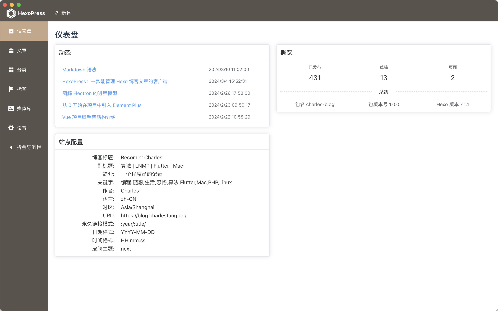

记录一些怎么也记不住写法的 Markdown 语法。

<!--more-->

## 一、基础语法

### 1. 标题

```markdown
# 标题 1
## 标题 2
### 标题 3
```

### 2. 强调

```markdown
**加粗**
_斜体_
_**粗斜体**_
<u>下划线</u>
~~删除~~
```
实例：**这里是加粗的文字**，_这里是斜体文字_，_**粗斜体**_，<u>这里是下划线</u>，~~这里是删除文字~~

### 3. 特殊

```markdown
文字<sub>下标</sub>
文字<sup>上标</sup>
```

实例：水分子 H<sub>2</sub>O，相对论等式 E = mc<sup>2</sup>

### 4. 引用

```markdown
>这里是引用文字
--哈哈哈
```

实例：

>本来是没有路的，走得人多了，就成了路
——鲁迅


### 5. 列表

```markdown
* 无序1
* 无序2

1. 有序1
2. 有序2

- [ ] 未完成任务
- [ ] 未完成任务
- [X] 已完成任务
```

实例：

* 无序1
* 无序2
* 无序3

1. 有序1
2. 有序2
3. 有序3

- [ ] 未完成任务
- [ ] 未完成任务
- [X] 已完成任务

### 6. 链接

```markdown
[链接文字](https://blog.charlestang.org)
```

实例：

[Becomin' Charles](https://blog.charlestang.org)

### 7. 代码

````markdown
```<language>
```
行内代码，`code`
````

### 8. 图片

```markdown

```

实例：


## 二、复杂语法

### 1. 表格

#### 基础

```markdown
| Syntax      | Description |
| ----------- | ----------- |
| Header      | Title       |
| Paragraph   | Text        |
```

实例：

| Syntax      | Description |
| ----------- | ----------- |
| Header      | Title       |
| Paragraph   | Text        |

#### 对齐

```markdown
| Syntax      | Description | Test Text     |
| :---        |    :----:   |          ---: |
| Header      | Title       | Here's this   |
| Paragraph   | Text        | And more      |
```

实例：

| Syntax      | Description | Test Text     |
| :---        |    :----:   |          ---: |
| Header      | Title       | Here's this   |
| Paragraph   | Text        | And more      |

## 三、皮肤特有

### 1. 引用

```markdown
本来是没有路的，走得人多了就成了路
Elegant in code, simple in core
```

实例：

本来是没有路的，走得人多了就成了路
Elegant in code, simple in core

### 2. Note

````markdown

#### Header
(without define class style)



#### Default Header
Welcome to [Hexo!](https://hexo.io)



#### Primary Header
**Welcome** to [Hexo!](https://hexo.io)



#### Info Header
**Welcome** to [Hexo!](https://hexo.io)



#### Success Header
**Welcome** to [Hexo!](https://hexo.io)



#### Warning Header
**Welcome** to [Hexo!](https://hexo.io)



#### Danger Header
**Welcome** to [Hexo!](https://hexo.io)



#### No icon note
Note **without** icon: `note info no-icon`



#### Details and summary
Note with summary: `note primary This is a summary`



#### Codeblock in note

```
code block in note tag
code block in note tag
code block in note tag
```


````


#### Header
(without define class style)



#### Default Header
Welcome to [Hexo!](https://hexo.io)



#### Primary Header
**Welcome** to [Hexo!](https://hexo.io)



#### Info Header
**Welcome** to [Hexo!](https://hexo.io)



#### Success Header
**Welcome** to [Hexo!](https://hexo.io)



#### Warning Header
**Welcome** to [Hexo!](https://hexo.io)



#### Danger Header
**Welcome** to [Hexo!](https://hexo.io)



#### No icon note
Note **without** icon: `note info no-icon`



#### Details and summary
Note with summary: `note primary This is a summary`



#### Codeblock in note

```
code block in note tag
code block in note tag
code block in note tag
```
