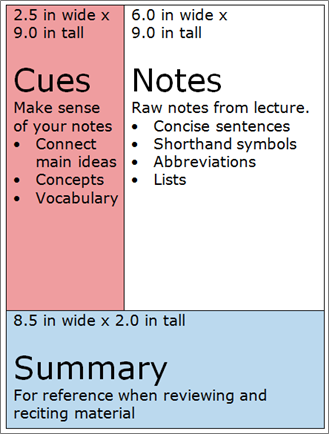

康奈尔笔记法，是一种记录笔记的方法，或者，你也可以认为是一种学习方法。

在康奈尔大学的官方网站，LSC（[Learning Strategies Center](https://lsc.cornell.edu/)）上，你可以[学习到这个笔记记录方法](https://canvas.cornell.edu/courses/1451)。

<!--more-->

## 灵魂拷问

1. 你为什么记录笔记？
2. 你希望从你的笔记中获得什么？

有些网上文章，或者自媒体，会堂而皇之地写道，世界公认的最好的笔记记录方法云云，殊不知，康奈尔 LSC 官网上，自己都没有这么吹嘘过。

事实上，也根本没有什么“最好”的方法，只有最合适的方法，而合适与否取决于你的目的。

## 什么是好的笔记？

对每个人来说，好的笔记是“有用的”的，它必须能够服务于你记录笔记的目的。

“有用的”又是体现在“事后”，例如，你去学习一种知识或者技能，学习的当时，记录笔记甚至可能会让你分心，不能全身心的学习，你之所以愿意承担这个风险去记录笔记，就是为了在此之后，记录下来的笔记，可以起到某种作用。

可能是帮助你复习，掌握，思考等等。

有了上述的检验标准，你就知道自己的笔记方法和风格，是否是一个“好的方法”。

## 康奈尔笔记法

这是一个比较简洁的笔记记录方法，建议将一张纸分成三个区块。

首先，分成上下两部分，上面比较大，底下比较小，上面用作记录和复习，底下用作总结。

然后，上面部分，分成左右两部分，左边小一点，右边大一点，右边是主要的记录区域，而左边则是用作提炼，复习，或摘要等。

这个方法里，主要的区域叫“笔记区”，英语是 Notes，这里主要罗列一些重要的事实和知识点，或者老师讲述的内容要点。也就是上课学习的时候，需要记录的东西写在这里。

一般按照学习顺序，或者时间顺序等等，使用精简概要的记录法，提高记录的效率，避免在课堂过度分心。

上面部分左边的区域叫“线索区”，英语是 Cue，在这里，应该记录一些重要的问题，疑问，或者核心的线索，关键字等等。这里有个作用，就是记录一些提示，帮助你把原始的笔记的所有内容都穿起来，或者提示一下重要的点。

在课后复习的时候，你可以通过左边 Cue 的区域，去回忆右边记录的课程内容，同时也在精炼整个学习的内容。

最底下部分则是“总结区”，英语是 Summary，尝试用自己的话，去概括本次学习到底学到了什么重要的知识。

## 康奈尔笔记的用法

康奈尔笔记法，给了很简单的策略，划分纸面的区域，和规范记录的内容。它这么建议的根本原因是，希望将一个简单的学习原理，推荐给所有的学习者。

这个简单却重要的原理就是“复习和总结”。

“线索区” 的填写，也是建议发生在学习后的，而且应该是学习后“立即”。当你下课后，你应该马上回顾自己的课堂笔记，把重要的疑问和关键点，都记录在“线索区”。

这些问题和关键字，帮助你精炼一节课的内容。而这个时候，正是你刚刚完成课程，记忆最活跃的时候，就得到了第一次强化。

而以后，复习笔记的时候，也是通过左边的“线索区”去回忆，而无法回忆起来的时候，再去看右边的“笔记区”。

而底下的“总结区”也尤为重要，就是用自己的话去概括学习内容的一个过程，这其实是要求学习者去精炼自己的知识，这个过程强迫大脑去加工和激活学习到的新内容，从而起到了刺激思考和加深记忆的作用。

## 高效学习法

与其说康奈尔笔记法，是一种记录笔记的方法，不如说，这是一种高效的学习方法。无数学者教授，都已经证明过的有效的学习方法。

这未必是最好的，但是确实是一种非常容易上手掌握的学习方法。也是大多数人可以轻松操作和习得的方法。

所以，很自然，这个方法出现在 LSC，学习策略中心的网站上。

## 总结

康奈尔笔记法，是一种学习方法和笔记记录方法，且是以学习、记忆、掌握为主要目的的学习和笔记记录方法和风格。

方法简明易操作，已经被很多学者教授证明卓有成效，非常适合小白学习和使用。
