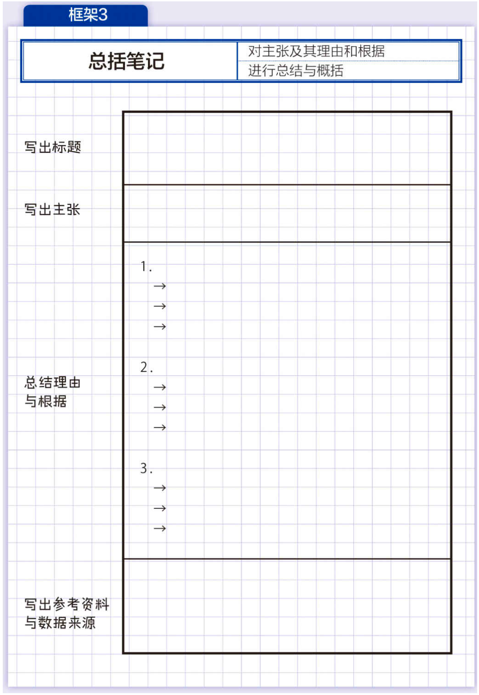

最近，读了《麦肯锡笔记术》。介绍了麦肯锡管理顾问的一种工作方法：笔记术，他们是如何通过笔记进行思考，从而解决问题的。

<!--more-->

全书讲解了如何通过笔和本子进行记录，加深思考，最后找到解决问题的方法。所以，就不是单纯地用“笔记术”来概括全书的内容，笔记术只是一个基础和出发点，本质上，介绍的还是如何有条理地，按部就班地思考和解决问题的方法。

## 为什么使用笔和本子可以促进思考？

这是一个很好的问题，也是我一直以来的疑问。这本书给出了作者的一个解释。“锻炼思考能力不能只在大脑中进行。”在使用纸笔进行书写的时候“我们还需要将五感都充分地利用起来”。

那么为什么将“五感”都充分地利用起来，就可以促进思考呢？这个作者没有深入的解释，不过我曾经问过 DeepSeek 这个问题，它给出了一些答案。

> > 核心原因解析
> > **触觉认知增强效应**
> > 神经科学研究显示，手写动作会激活大脑的“感觉运动网络”，促进信息编码（James & Engelhardt, 2012）。每当你用笔划掉任务时，基底神经节会释放多巴胺，形成正向强化循环，这是数字界面难以模拟的神经奖励机制。
> >
> > **有限注意力原理**
> > 纸质系统的物理限制（页面空间有限）迫使进行优先级筛选，符合 Hick 定律（选项数量与决策时间成正比）。相比之下，数字列表的无限扩展性导致「任务膨胀效应」，前额叶皮层长期处于决策疲劳状态。
> >
> > **界面认知负荷差异**
> > 根据 Nielsen 的可用性法则，纸质系统具有零学习曲线的自然映射（Natural Mapping）。而数字工具的功能复杂性（标签、项目、提醒等）产生界面摩擦，消耗工作记忆资源（Sweller的认知负荷理论）。
> >
> > **时间感知具象化**
> > 纸质日历的视觉空间布局激活大脑的“心智地图”能力（O'Keefe & Nadel, 1978），将时间维度转化为空间表征。手写规划时，海马体与顶叶皮层的协同增强时间感知准确性。

书里有这么一段话，我觉得可以引用一下：

> 人类的大脑从功能上来说，可以分为三部分。
>
> 首先是对呼吸中枢和自律神经进行调节、维持人类生命的脑干；其次是对人类的食欲、性欲、睡眠欲等各种欲望和喜怒哀乐进行控制的大脑边缘系；最后是控制语言和思考等人类理性活动的大脑新皮质。通过大脑非常复杂的组合作业，人类才能进行思考和记忆。
>
> 请大家回忆一下自己的学生时代，有没有过考试之前突击复习，拼命记忆书本中的内容，结果一觉醒来全忘光了，最终考试一塌糊涂的经历呢？
>
> 当我们尝试记忆某种事物的时候，位于大脑边缘系的海马体会首先对信息进行过滤，然后将过滤后的信息送往负责记忆的大脑新皮质。因此，有时候我们想要记住的内容可能会被过滤掉导致没有记忆。这在记忆模式中被称为“陈述性记忆”。
>
> 与之相对的，还有一种被称为“程序性记忆”的记忆模式。这种模式属于身体记忆的类型，需要用到大脑更深处的“大脑基底核”以及小脑的神经网络。
>
> 就像小时候反复练习骑自行车，一旦学会之后就算很长时间没骑，身体也一直记得骑自行车的方法一样，利用身体的行动来帮助记忆，只要记住了就永远也不会忘记。也就是说，写笔记这种行为，在身体行动的配合下能够使大脑更加活跃，不仅可以加强记忆，还能起到加深思考的作用，可谓是一举两得。

## 执行麦肯锡笔记术的基础

奉行麦肯锡笔记术，有一些基本的原则，就是在使用笔记的时候，始终明确一点，记笔记是有目的，记录只是手段，并不是目的本身。那么你的目的到底是什么？这就很重要了。

麦肯锡笔记术，显然是面向管理咨询顾问的一种工作方法，那么管理咨询顾问的工作目标是什么？解决客户的问题，所以对于一般职场的牛马来说，都很适合学习麦肯锡笔记术。使用笔记的目的，一般都是解决问题，工作中的问题，乃至生活中的问题。

### 原则1：先写结论

先写结论，我觉得其实是强调目标导向思维，一页笔记必须要要一个标题，而标题被写在最上面。我个人的理解是，这个原则，强调的其实是位置，结论或者标题应该写在最上面，或者左上角。

我们在记录笔记和整理后，得出结论，这是一个比较正常的发生顺序，但是习惯性地把思考所得记录在最后，是一个不好的习惯，而是应该提出来，放到最上面或者最前面。

另外一个点是，要养成“总括”的习惯，这是一个提高效率，增加解决问题成功率的方法。

### 原则2：一页一个主题

笔记写出来是要看的，尽可能让相关的内容，聚集在一页里，增加资料和信息的关联，有利于思考。

这个原则一是说，思维要集中，不要在一张纸上写不同的内容，另一是说，信息和资料也要在记录的时候筛选，不要让一个事情，扩散到两页里去，那样效率就会降低。

### 原则3：利用 5W2H 来做笔记

这是一种思考方式，就是怎么快速抓住一个事物的本质，记录要简洁。

抓住本质就是问，为什么 Why，什么事 What，什么时候 When，什么人 Who，什么地方 Where，怎么做 How to，多少数量 How much。

听到一段话，把这些点记录下来，就抓住了这个事情。这里“为什么”放在前面，也是提醒记录者，始终记得自己的目的是什么。

### 原则4：边写边想，边想边写

笔记只是思考的工具，没必要太过整洁美观有序。关键问题是要事后的深度反思和整理。所以，作者主张，边写边想，同时把新想到的东西写下来，从而加深思考。

记录在纸上的东西，有时候会成为大脑记忆的索引，我们的大脑会记住很多事情，但是，有时候事情多了不容易想起来。但是在记录的过程中，记忆被加深，并在纸上留下了索引，事后观看的事后，就可以快速的想起来。

同时“思考的重复运动”，可以“帮助我们找回重要的记忆”。记录笔记，使用了 5W2H 其实是把大脑里散乱的记忆排列整齐的一个过程。写出来又是建立索引的过程。这时候，一些深层次的记忆容易被闪回出来。其实就是整理了自己的大脑。

“思考训练很重要”，但是训练“不能只在大脑中进行”，在“笔记本上做记录”，可以强化思考，取得结果。

### 原则5：保留足够空白

空白能够激发想象。而留白的关键在于“适度”。

## 记笔记的四个技巧

有了上面的基本原则和基础，就要正式开始介绍如何使用笔记进行思考。这里很重要的一个点，就是介绍了思考问题的基本步骤，这是一个通用的步骤，可以被用来解决任何问题。

1. 设定问题与确定论点
2. 整理课题并结构化
3. 现场调查
4. 建立假设
5. 验证假设
6. 确定解决方案
7. 执行

通过笔记本和手写，帮助我们面对任何问题的时候，执行上面的步骤。

### 技巧1：一目了然的标题

首先就是要搞清楚问题到底是什么，我们总是容易在一天的庸庸碌碌中，忘记自己的工作目标，一个好的标题，可以让我们保持清醒。

好的标题必须是“一条信息”且“具体”。"用词越简洁越好”。我们往往可以将标题表达成一个问题，比如“是否应该开创新事业？”，“是否应该结婚？”这么做是因为，回答问题是大脑的天性。我们写下问题的标题，可以发挥大脑回答问题的能力。

### 技巧2：将页面三等分

当我们在笔记本上大规模收集信息的时候，需要让这些信息更为有序被归类，这样才能有索引的效果。

三等分有很多方法，依据场景的不同来决定。

#### Where，Why，How

问题在哪里？写出问题出现的地方，比如“某产品销量不佳”，“新用户减少”等。

然后记录原因是什么，比如“产品过时”，“促销不足”等。

最后写下对策“推出新产品”，“加强促销”等。

> 笔记本上要明确地将定义问题的“Where”写出来。只要找出问题的所在，原因和对策也会自然地浮现出来。然后只要对信息进行整理，就可以让思考朝着解决问题的方向发展。

#### 著名的“空，雨，伞”

空，代表客观事实，就是天空上现在什么情况。比如“乌云密布”。

雨，代表对客观事实的解释，比如“马上要下雨了”。

伞，代表行动，其实就是结论。比如“出门要带伞”。

#### 3C 法

这是市场营销角度的问题分解法。

Customer，也就是顾客，到底是谁？

Competitor，竞争对手有哪些，他们有什么行动？

Company，也就是公司，我方，应该做出什么选择？

这里提一下，网上一提到麦肯锡笔记，就只说个“空雨伞”，我不知道怎么回事，至少这本叫《麦肯锡笔记术》 的书，空雨伞，只是一个小小的技巧中的一种而已。

### 技巧3：图表可视化

当我们收集了太多的信息后，需要对信息进行整理。为了在整理的过程中，保持“总括化”思考的意识，我们需要将内容进行结构化，利用图表，可以强化这种意识和提高效率。

这里就是著名的金字塔思维的具象化，利用金字塔图表，将信息排布成金字塔形状。

### 技巧4：30 秒总结

这个技巧，来自著名的“电梯测试”，就是你遇到的公司的总裁，能不能在一起坐电梯的时候，讲清楚自己的问题，观点和解决方案？

如果你经过了充分的思考，逻辑非常清晰，就可以做到。比如：

> 我认为我们公司应该立刻进军××事业。因为这个市场正在飞速发展，今后需求可能会进一步扩大，是一个很有吸引力的市场。我们公司在这一领域能够充分发挥自身的技术实力和开发实力。因为其他竞争对手很少，如果我们现在进军这一领域，能够在一两年的时间内获得市场份额第一。公司的业绩也能因此得到提升。

## 如何整理思考

上面已经介绍了笔记术的基本原则和技巧，下面就是对思考这件事本身的一些辅导。整理思考的重要方法是，将各种信息进行关联，按因果链进行关联。

一个重要的方法就是问自己“So What？”那又怎么样？有了答案后，再追问自己“Why So？”为什么会这样？通过这样的追问方式，将自己已经掌握的，以及自己能够想到的，都归集成一条因果链，其实完成这个工作，解决问题的方法，几乎呼之欲出了。

### 思考技巧1：建立假设

有时候我们总是被纷繁复杂的现实绕晕了，也会被旁枝末节吸引注意力，建立假设的技巧，其实就是跳出去，思考“事情本来应该是怎样的”，你就不会被现状，导致现状的问题等等琐碎给迷惑。

### 思考技巧2：信息分类

前面介绍了 Where，Why，How 的三分类排版，这个其实也是一个信息分类的思考技巧，从这个角度，思考和笔记术就合二为一了。

### 思考技巧3：解决问题的 4 个步骤

这个其实前面也提过，就是解决问题的通用步骤和流程，总是训练自己去按照这个模式解决。

1. 真正的问题是什么？
2. 假设是什么？
3. 验证假设
4. 整理成果

## 一些笔记模版

金字塔图表

自我追问

总括模版

解决问题模版

## 总结

阅读和学习了《麦肯锡笔记术》，我的感觉是，对一些生活学习中，常见的思路和笔记记录方法，进行了一次盘点。不过对我个人来说，整体的信息偏简单了。我很早就学习过各种此类技巧，《金字塔思维》也是学习了多年了。所以，感觉好像没有太多的东西。

不过对于年轻人来说，入门挺好的。

-- End --
