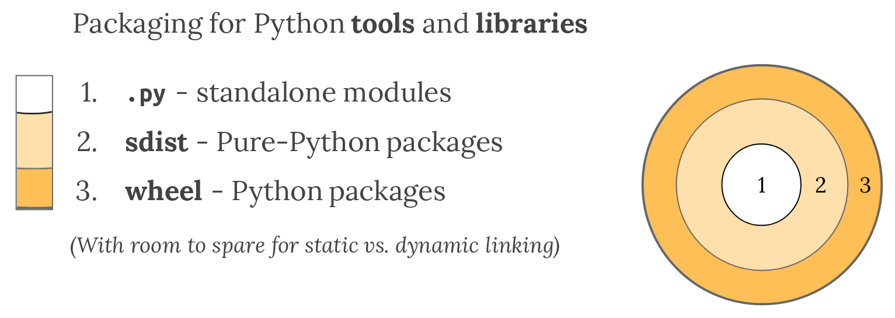

我在使用 Mac 的命令行管理自己的服务器的时候，我一直使用一个 goto 的命令，这个命令会列出所有的服务器列表，里面包含用户名，IP 地址，以及备注，我只要再键入一个序号，就可以自动发起对服务器的连接。这个脚本是我自己写的，是一个 Python 的命令行脚本。今年，这个脚本不能运行了，后来我打开 Cursor 寻求解决方法，AI 建议我将这个命令打包封装。

<!--more-->

> 建立你对 Python 打包的理解，是一个旅程。耐心和持续地改进是成功的关键。 —— 《Python 打包用户手册》

## Python 打包概览

Python 是一门极度灵活的编程语言，可以应用于各种领域，网站，命令行工具，AI脚本等等。所以，在一个 Python 项目中，我们必须考虑其受众和对应的运行时环境。虽然，早早考虑这种问题，会显得很奇怪（啥都还没有，就开始想打包分发了），但是这么做确实可以避免很多麻烦。

### 为什么需要打包

如果你在本地编写一段脚本，并且只在本地运行，并且过一段日子，这个脚本就彻底弃用，你是不用考虑打包的，这就是普通的一次性临时脚本。

但是，如果你现在编写的脚本，你是希望长期在你自己的电脑上运行，或者分发出去让别人也能运行，你就不得不考虑打包的问题。

比如我遇到的问题，脚本是我几年前写的，现在随着系统升级突然不能用了。

我在 Mac 上开发的脚本，在 Linux 服务器上无法使用，也可能反过来。

这些问题，都让你不得不思考，如何将 Python 的脚本，组织成一种比较稳定的，自包含的结构，方便使用它的人，能比较简单维护这个脚本的使用状态。

当然，打包的目的也就很清楚了，你需要让你的脚本或者包，依赖的其他包，依赖的环境，版本等等，都能形成一个闭包，想要使用它的人，可以通过简单的部署安装，就直接使用。

### 打包的方式

Python 的代码有很多的打包方式。

**模块**

需要分发的是 Python 的代码文件或者片段，只依赖的标准库，这种形式的一般是 Python 模块。

**源码**

一个 Python 项目，必须按照一个特定的目录结构来放置，这是代码一般使用源码的形式来打包。

**二进制**

Python 的很多能力来自跟软件生态的整合，尤其是那些用 C，C++ 编写的类库，但是不是所有使用者都有合适的环境用于编译这些代码，所以 Python 创建了 Wheel，一种打包格式，用来分发编译好的工件。比如 pip 就喜欢使用 wheels，因为安装速度很快，而且，就算纯 Python 代码，也可以 wheel 的形式良好工作。



## 打包的流程

首先准备好源代码仓库。

然后需要准备一个配置文件，描述软件包的元数据（名称、版本）以及如何构建的信息（依赖）。比如我们可以在源代码库的根目录维护一个 `pyproject.toml` 的配置文件。

创建要发送到包管理服务的构件，通常包含一个源代码分发版 `sdist` 和一个或者多个 `wheels`。这些 wheels 可以使用上面的配置文件来命令生成。

将所有文件上传到包分发服务。

### 配置文件

`pyproject.toml` 至少需要包含一个 `[build-system]` 区段，用于设置构建工具。

```ini
[build-system]
requires = ["hatchling"]
build-backend = "hatchling.build"
```

此外还需要包含一些段落，比如 `[project]` 和 `[tool]`等。详细的请参阅指南。

### 构建

构建源代码包

```shell
python3 -m build --sdist source-tree-directory
```

构建 wheels

```shell
python3 -m build --wheel source-tree-directory
```

### 上传到包分发服务

```shell
twine upload dist/package-name-version.tar.gz dist/package-name-version-py3-none-any.whl
```

### 下载安装

```shell
python3 -m pip install package-name
```

### 本地安装

在本地安装，有两个命令

```shell
pip install -e .
pip install .
```

只要在项目的根目录执行上面的命令就可以，使用 `-e` 参数，可以调试安装，这样就算装好后，如果你去修改代码，代码也会立刻生效。这样非常方便。

## 范例配置文件

我之前给我写的 goto 指令打包了，撰写了配置文件，不过我没有发布到包管理服务。只是用于自己本地安装。

```ini
[build-system]
requires = ["hatchling"]
build-backend = "hatchling.build"

[project]
name = "goto-cli"
version = "1.0.0"
description = "A CLI tool for quick SSH server access"
authors = [{ name = "Charles Tang", email = "charlestang@foxmail.com" }]
dependencies = ["PyYAML>=3.13"]


[project.scripts]
goto = "goto.main:main"

[tool.hatch.build.targets.wheel]
packages = ["src/goto"]
```

## 参考

https://packaging.python.org/en/latest/
