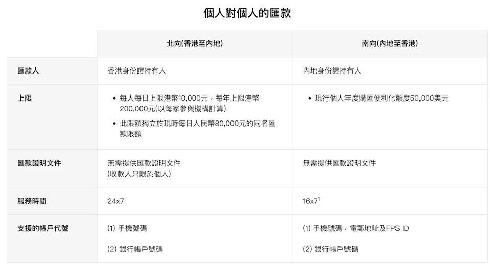

这两天我去河内团建了，不在香港，政府又推出了一项利好。

这次是一项便民服务 —— **中国人民银行**和**香港金管局**在 6 月 20 日，联合发布了于 6 月 22 日开通“**跨境支付通**”的新闻。

对于我们这些需要照顾内地家人的港漂来说，无疑是一项利好。那么，到底“跨境支付通”提供了什么便利？本文为你揭开答案。

<!--more-->

### 什么是“跨境支付通”？

“跨境支付通”是一种全新的支付清算方式，它的推出为内地、香港两地居民的日常生活消费提供了极大的便利。

> 据悉，与香港间的“跨境支付通”是内地的网上支付跨行清算系统（IBPS）与香港快速支付系统“转数快”（FPS）的互联，用户只需输入收款方的手机号码或银行账户号码，即可进行小额跨境汇款，实时到账。

太复杂的东西，也不容易理解，大家只需要知道，在小额、生活场景下的支付，有了“跨境支付通”就会非常方便。

通过“跨境支付通”付款，可以做到：**24x7 实时到账**、**价格优惠 0 手续费**、**操作便利**。

两地居民往来内地香港买买买，就会变得十分轻松简单。对大湾区居民尤其利好。

### “跨境支付通”有多方便？

以前我在上海生活，个人之间的小额转账，我们一般使用支付宝或者微信操作，十分便捷，因为两个 App 都绑定了银行卡，而两种支付通道又十分强大，轻易就可以完成转账。

如果额度较大，比如 10 万这样，使用支付宝、微信，就会收到提款限制。不过也不用担心，只要登录手机银行 App，输入对方的账号，也可以实时免费完成转账操作。

而我在香港生活的时候，我发现香港也有很方便的基础设施，叫“转数快”，就是上面引文的 FPS。转数快，要求将用户的手机号，Email，身份证号等个人识别信息，绑定到银行账户，然后转账的时候，通过其中一个信息作为账号信息（不用指明对方银行），就可以完成转账，也是可以实现实时、免费转账。

而“跨境支付通”正是将内地、香港两个清算系统，进行了连接。以后，从香港往内地个人账户转账，不管是往自己的同名账户，或是其他人的个人账户，都可以用手机号或者账户号进行转账，对于香港人来说，就好像使用转数快一样，熟悉而且便利。而反过来也是一样，从内地往香港，可以用手机号、Email 等 FPS ID，再加上一个收款银行信息，就可以实现转账。

### “跨境支付通”的限制

前面也说了，跨境支付通，是用于覆盖小额、生活场景，所以其主要限制就是在额度方面了。

从香港往内地转账，每天不能超过 10,000 港元，全年不能超过 200,000 港元。与向对面本人同名账户的每天 80,000 港元的额度不共享。虽然看起来一年只有 20 万港币，不过一般情况下，普通满足普通三口之家一年的消费几乎也都够了。

而从内地往香港转账，则是受到个人年外汇额度 5 万美元的限制。

除此以外，几乎再无限制。手续无比简单，掏出手机就能操作，不用登录电脑端网银插优盾，不用去银行柜台，不用填表，还实时到账，还 24 x 7 在线服务。

简直堪称完美。

#### 银行

可惜，不是所有银行都支持这项服务。首批只有 6 + 6 银行支持。不过，已经覆盖了绝大多数人拥有的账户了。

香港支持的银行有：**中银香港、汇丰、恒生、东亚银行、建银亚洲、工银亚洲**。

内地支持的银行有：**工行、农行、中行、建行、交行、招行**。

#### 币种、汇率

| 方向 | 扣账币种 | 入账币种 | 单日上限 | 年度上限 | 占 5 万美元额度？ | 手续费 |
|------|----------|----------|----------|----------|------------------|--------|
| 港 → 内 | HKD / CNY | **CNY** | 1w港元 | 20w港元 | **否** | 0 |
| 内 → 港 | CNY | CNY / HKD | — | 5w美元 | **是** | 0 |

> **记住**：北向不占结汇额度；南向购汇计入 5 万美元年度额。

从香港 --> 内地的转账，可以选择的币种有港币、人民币；内地账户一律会收到人民币。而且不受到个人 5 万美元结汇额度的影响，因为收到的直接就是人民币。

而从内地 --> 香港的转账，只能选择用人民币汇出，受到个人 5 万美元购汇额度的限制。而香港账户可以选择收到的是人民币还是港币。

从香港汇出港币的时候，需要关注所在银行提供的汇率，目前是不收取手续费的。而如果直接汇出离岸人民币，可以认为是无损的汇款。

而从内地汇出人民币，到了香港，选择收取港币则也需要考虑汇率的影响，而选择收取立案人民币，也是无损的。

#### 用途

使用此通道，用途不能是金融类用途，买房，股票等。

### 以前资金怎么跨境

大家可能无法意识到，这项服务带来了多大的便利，我们不妨回忆一下，没有此服务的时候，我们怎么转账。

比如，要去香港读大学，需要从内地转一笔学费到香港。

| 项目 | 跨境支付通 | 传统 SWIFT 电汇 |
|------|-------------|-----------------|
| 到账速度 | **秒级** | T+1 ~ T+3 |
| 手续费 | 0 | ¥150–200 + 电讯费 |
| 填写信息 | 手机号 / 账号即可 | 姓名、地址、SWIFT Code、用途… |
| 使用场景 | 日常消费、学费、薪资 | 大额投资、购房、企业付款 |

我们需要首先在银行账户进行购汇，然后通过网银汇往香港的个人同名账户。

1. 不是随便什么时候可以的，必须在银行对应的系统开放时段；
2. 走的是 SWIFT 通道，有高昂的手续费，一般是 150-200 每笔；
3. 填写的理由也要小心翼翼，很多时候会受到银行的审查和驳回；

而往非同名账户汇款就更难了，可能还需要去银行提交真实资料，交易证明等等。

而从香港往内地汇款，如果是往个人同名账户汇款的话，每天的限额是 8 万人民币（2018 起支持），注意，在香港要先更换离岸人民币。而如果往内地汇港币，则更麻烦，要占用内地个人 5 万美元结汇额度，超额的话，需要提交证明材料。

而从香港往内地非同名账户汇款，则一定要提交真实交易证明。

### 总结

跨境转账终于像发红包一样简单。  

**收藏 + 转发**，让更多港漂、大湾区朋友少走弯路，少交冤枉费！

你有被 SWIFT 手续费劝退的经历吗？评论区聊聊~

### 参考

1. [跨境支付通](https://fps.hkicl.com.hk/schi/fps/consumers/payment_connect.php)
2. [“跨境支付通”今日上线！输入手机号 内地与香港两地居民即可实时跨境汇款](https://finance.sina.com.cn/stock/relnews/cn/2025-06-22/doc-infawvuv0999991.shtml)
3. [跨境支付通正式上线，支持三大场景实时转账](http://www.news.cn/tech/20250623/8c0b4c1b135444ffb678655d46753f2f/c.html)