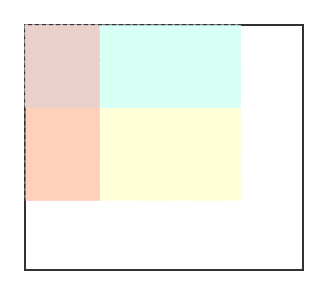

今天的打卡题，我一看，是一道“中等”难度的题，心里一咯噔，一般我不太能做出来的。不过细看了一下还好，今天的题目，我刚好会做，这个是一个二维矩阵的题目，给定左上角和右下角的座标，求框定区域内的数字总和。

题目提示是会多次查询，其实就是提醒你，不要用两层循环去做，因为那样单次计算的时间复杂度是 O((row2 - row1 + 1) * (col2 - col1 + 1))，相当于 2 次多项式时间。那么我们的做法，唯有事先做一次字典，然后每次去查表，我们用一个和 matrix 同等维度的二维字典，每个元素存储的值就是矩阵对应位置的到左上角，也就是（0，0）这个二维区域内的数字总和。



就是计算上图中黄色的区域的面积

那么，计算指定区域面积，就成了一个O(1)的算法。如上图，就是计算图中黄色区域的面积，等于整个彩色区域面积，减去蓝色，减去红色，加上左上角暗红色。

```python
class NumMatrix:

    def __init__(self, matrix: List[List[int]]):
        self.matrix = matrix
        self.sumdict = []
        for i in range(len(matrix)):
            sumcol = 0
            coldict = []
            for j in range(len(matrix[i])):
                sumcol += matrix[i][j]
                tmp = sumcol
                if i > 0:
                    tmp += self.sumdict[i-1][j]
                coldict.append(tmp)
            self.sumdict.append(coldict)

    def sumRegion(self, row1: int, col1: int, row2: int, col2: int) -> int:
        res = self.sumdict[row2][col2]
        sum_up = 0
        sum_left = 0
        sum_up_left = 0
        r, c = 0, 0
        if row1 > 0:
            sum_up = self.sumdict[row1 - 1][col2]
        if col1 > 0:
            sum_left = self.sumdict[row2][col1 - 1]
        if row1 > 0 and col1 > 0:
            sum_up_left = self.sumdict[row1 - 1][col1 - 1]

        res = res - sum_up - sum_left + sum_up_left
        return res


# Your NumMatrix object will be instantiated and called as such:
# obj = NumMatrix(matrix)
# param_1 = obj.sumRegion(row1,col1,row2,col2)
```

我写出了如上的算法，一次提交就过了。心情不错:)