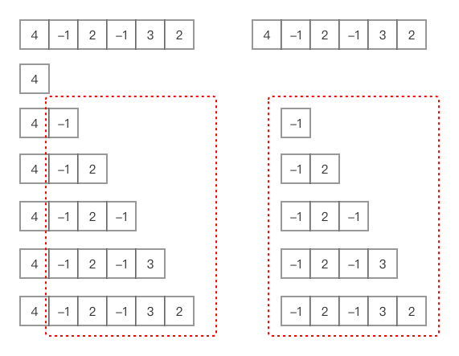
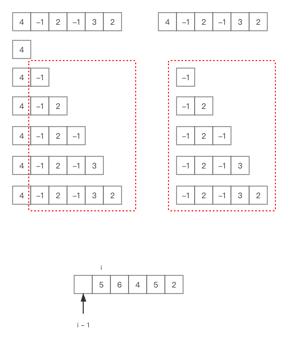

先来看看题目：

> 给定一个整数数组 nums ，找到一个具有最大和的连续子数组（子数组最少包含一个元素），返回其最大和。
> 
> 示例 1：
> 
> **输入**：nums = [-2,1,-3,4,-1,2,1,-5,4]  
> **输出**：6  
> **解释**：连续子数组 [4,-1,2,1] 的和最大，为 6 。
> 
> [53. 最大子序和](https://leetcode-cn.com/problems/maximum-subarray/) <-- 传送门

一看到题目，我是懵逼的，完全不知道怎么做。我只知道穷举法，穷举完所有的子序列，并求和，就可以得到最大的值是多少。不过，当题目里出现了“最大”之类的字眼，然后，一看又需要穷举的情况，往往意味着，这道题目需要使用动态规划来求解。我们看看如果穷举的话，时间复杂度是多少，从第 0 个元素开始的子序列，有 n 个，从第 1 个元素开始的子序列，有 n - 1 个，……， 以此类推，总共 n ( n + 1 ) / 2 个子序列，时间复杂度是 O(n^2) ，很显然了。提示里说，数组长度不大于 3 万，平方一下就是 4.5 亿次求和，真穷举的话必然无法 AC 了。

复习一下动态规划的先决条件，重叠子问题，最优子结构，无后效性。我个人学习的感受是，我们往往很难写出合适的状态转移方程，其实就是不能把问题规约成规模更小的子问题。看官方题解，你总是会惊叹于，怎么会想到把子问题看成这个模样呢？我怎么想不到呢？

这个题目，我们来看看怎么解，比如我穷举总是会的：



穷举法

这个图，显示了我的穷举法，首先是第 1 个元素 4 开始的子序列，一共有 6 个，然后是第 2 个元素 -1 开始的子序列，一共有 5 个 ……

图里展示了穷举的前两次循环。然后我们发现一个问题，穷举第 2 个元素开始的所有子序列的 Sum 的计算，在穷举第 1 个的时候，又重新计算了一遍。如果，我们在计算第 2 个元素开始的所有子序列的和的时候，缓存下来结果，那么，计算第 1 个的时候，我们只要在利用缓存的结果，就可以大大节省求和的量。我们注意到，如果我们先算第 2 个元素开始的，再算第 1 个开始的，会比较容易一点。不过这需要倒序来穷举，倒也不难。

再进一步，我们目标是求最大值，是不是，只要缓存一个最大值就够了？例如图中，第 2 个元素开始的所有子序列里，Sum 最大的是 5，而第 1 个元素开始的所有子序列里，Sum 最大的显然就是 5 + 4 = 9 了。



使用缓存数组帮助求解，注意图里 i 是输入数组的下标

好，现在可以开始编写题解了。我们使用一个数组，记录第 i 个位置开始的所有子序列 Sum 的最大值，它左边，第 i - 1 个元素开始的子序列的最大值，就是再加上当前第 i - 1 个元素：

```python
class Solution:
    def maxSubArray(self, nums: List[int]) -> int:
        l = len(nums)
        if l == 1:
            return nums[0]
        dp = []
        dp.append(nums[l - 1])
        for i in reversed(range(l - 1)):
            dp.append(dp[l - 2 - i] + nums[i])
        return max(dp)
```

从数组末尾开始，最后一个元素开始的最大子序和，就是它本身，所以，一开始我们把它加入到记录数组 dp 里（注意下标的问题，因为一开始 dp 是空的，所以第 0 个位置放的是我们想缓存的最后一个值，最后一个值的下标是 l - 1。接下来遍历的时候，为了计算第 i 个值，我们需要知道第 i - 1 个值，其下标是 l - 1 - i - 1，也即 l - 2 - i，这里有点绕）。然后，我们进行提交，就会发现，这个算法是错的。为什么呢？因为我们没有考虑负数带来的影响。

因为我们是倒着计算的，所以，每次计算第 i 个元素开始的所有子序和的时候，第 i - 1 个元素开始的所有子序和已经计算完了。我们不妨把第 i - 1 个元素开始的所有子序列，叫做第 i 个元素开始的所有子序列的后缀。那么，如果一个后缀的最大值是一个正数，那么第 i 个数加上这个后缀，一定变得更大，所以原来算法没问题。如果一个后缀是负数，那么第 i 个数加上负数后缀，就会变小，那么最大值反倒小了。这时候，最大值就是第 i 个元素本身，不用再加后缀了。

```python
class Solution:
    def maxSubArray(self, nums: List[int]) -> int:
        l = len(nums)
        if l == 1:
            return nums[0]
        dp = []
        dp.append(nums[l - 1])
        for i in reversed(range(l - 1)):
            if dp[l - 2 - i] < 0:
                dp.append(nums[i])
            else:
                dp.append(dp[l - 2 - i] + nums[i])
        return max(dp)
```

然后我们把算法改成了这样，提交，oh yeah，这回就做对了！

到了这一步，我们心里压力已经解除了，因为题目做出来了。这个解法的时间复杂度是 O(n)。空间复杂度，也是 O(n)，因为使用了一个缓存数组。不过，我们注意到，最后我们返回了 max(dp)，意味着，其实我们只需要一个值，不必一个数组，只要始终保持最大值就可以了。另外，我们计算 dp[i] 的时候，我们还要依赖 dp[i-1]，所以我们再用一个变量记住它就可以了。

```python
class Solution:
    def maxSubArray(self, nums: List[int]) -> int:
        l = len(nums)
        if l == 1:
            return nums[0]
        maxSum = preMax = nums[l - 1]
        for i in reversed(range(l - 1)):
            if preMax < 0:
                preMax = nums[i]
            else:
                preMax = preMax + nums[i]
            maxSum = max(preMax, maxSum)
        return maxSum
```

然后，代码被改成了这样。我们用 preMax 代替了 dp 数组，表示上一个位置的最大值，我们用 maxSum 记录了遍历过程中，出现过的最大值。空间复杂度被优化到了 O(1)。如此，我就展示了怎么从最朴素的穷举，推导出动态规划的过程。

在推理过程中，我们发现，倒序穷举的话，比正序穷举更能复用之前的计算结果。那么，我们现在是缓存了第 i 个元素开始的最大子序和，如果逆向思考一下，我们改为缓存第 i 个元素结束的最大子序和，代码会是什么样子呢？您可以自己写一下试试。