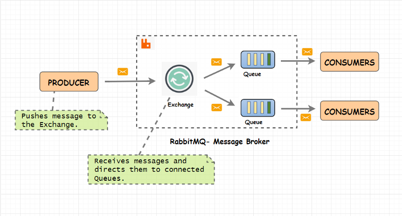

## Algorithm

这次跟大家分享的题目是我在练习使用回溯法时候的一道练习题：

给出 _n_ 代表生成括号的对数，请你写出一个函数，使其能够生成所有可能的并且**有效的**括号组合。

例如，给出 _n_ = 3，生成结果为：

```python
[
  "((()))",
  "(()())",
  "(())()",
  "()(())",
  "()()()"
]
```

以下是我的解法：

```golang
func generateParenthesis(num int) []string {

    result := []string{}

    //约束条件：左括号的数量，消耗快于右括号的消耗数量
    //结束条件：右括号数量消耗完毕
    //单步前进：消耗一个左括号或者右括号
    var put func(left int, right int, str string)

    put = func(left int, right int, str string) {
        if right == 0 {
            result = append(result, str)
        } else {
            if left > 0 {
                put(left - 1, right, str + "(")
            }
            if right > left {
                put(left, right - 1, str + ")")
            }
        }
    }

    put(num, num, "")
    return result
}
```

因为是回溯法的练习题，所以，一开始我就知道了应该用回溯法去解这道题目。回溯法是一种很基础的算法，经过一周的练习，我感觉，回溯法本质上就是一种穷举法的应用。一般，我们可能想到的穷举法，都是循环，两重循环，有两个下标，可以按部就班，没有重复和遗漏地从头穷举到尾。这种类型的穷举法，我们光凭直觉就可以写出来，并且写正确，能不能跑出来，就不一定了，因为效率问题嘛～

回溯法的穷举是另一种类型，就是我们可能很直观想到怎么去穷举这种问题，但是很难用代码去表达出来。需要一个关键的数据结构的帮助，我们才能有效编写算法。最经典的例题，其实就是“八皇后问题”。在一个国际象棋棋盘上，放上八个皇后，不能互相攻击。给出一种解法，或者要求给出所有解法。

直觉就是，现在第一行第一格放一个皇后，然后在第二行找个位子放第二个，以此类推，直到所有八个皇后都放上去了，如果放到一半发现所有的格子都不能放了，那么上一个可能放错了，把上一个皇后换到下一个可以用的格子，继续按照原有策略试，以此类推，不断修改上一个皇后的位置，上一个的上一个的位置，一直到找到一个正确的摆法，也可以一直到找到所有的摆法。

这个思路，描述起来很简单，但是如果用代码去写，我相信对于很多同学来说，还是非常困难的。以前，我对于自己写不出八皇后这个问题的代码这件事情，一直很自责，对自己的智商感到抱歉。不过，现在，经过学习我发现，其实只是因为我没有认真去学习回溯法，以及没有认真训练，所以，我不能掌握这种方法。我不应该为自己不是最顶尖聪明的人类而感到抱歉，我只应该为自己没有早一点开始训练，感到愧疚。

这种类型的题目，就是我说的，不是那么显然地能找到按部就班没有重复和遗漏的迭代变量的题目。主要的一个原因就是，很多时候，循环的层数可能是不确定的，给代码编写带来了很大的困难。比如，“八皇后问题”，经常被写成“N皇后问题”，八皇后你可以不厌其烦写八重循环，那么N皇后怎么个写法？

前面提到的很关键的那个数据结构，就是栈。先进后出的线性数据结构。这种数据结构的长度其实是可变的。我们只要每穷举一个步骤，就把此步骤的相关数据都保存在栈里，然后下一个，出了问题，就弹出上一个，这个过程是可以重复的，所以我们就有了能力穷举尝试完所有的步骤。与上面直观感觉描述的解法相吻合了。

说起来，回溯法的核心关键，正是去使用栈。每探索一个步骤，就用栈记住一切，然后，继续下一个步骤。栈这个东西，跟另一个程序的核心特性结合很紧密，于是往往可以让我们把代码表达得很简洁。那个特性就是让人又爱又恨的“递归”。

我想，每个程序员，在学习递归的时候，都掌握过这个知识点，就是函数可以自己调用自己，形成递归，那么上一重没有完成的函数，怎么办呢，它的所有信息保存在栈上，直到下一重返回。结合回溯法，如果利用递归来使用栈，就可以把代码表达得很简洁和优美。因为递归方法使用栈，都是隐性的，可以节省大量的代码。让我们专注在算法逻辑地撰写上面，而不是去处理压栈弹出等数据结构操作。

如果大家了解深度优先搜索，就会发现，其实这个压栈的处理，也很像深度优先搜索，所以，有些人写代码，经常把回溯法的主方法取名为 dfs，就是这个原因。我们都知道，深度优先搜索，是用在图上面的搜索算法，回溯法用到的题目，其实也是一种图，只不过是一种隐式的图，图的节点和边的定义没有明确给出，扩展的规则隐含在题目里的一种图。所以，回溯法有时候等同于深度优先搜索，也不奇怪了。

上面我写的括号生成的解法，是用 Go 语言实现的，也是偶然得到的一种灵感，写得非常简洁，思路也很清晰，所以特此分享给大家。以后我也想写一个文章，专门介绍，怎么理解回溯法，以及怎么在不同的题目里面去运用，怎么在最差情况下发挥得还不错。：）

## Review

本期想给大家分享的文章是：《[An introduction to RabbitMQ, a broker that deals in messages](https://www.freecodecamp.org/news/an-introduction-to-rabbitmq-a-broker-that-deals-in-messages-9e8f78194993/)》

broker 字典里是经纪人的意思，其实也可以叫中介，或者中间商，消息队列本质上就是处理消息的一种中间商，这是套用了基本经济学里面的概念。

消息队列中间件，就像是一种专门处理系统间消息的中间商或者说中介。RabbitMQ 就是这样一种中间件。它实现了很多消息队列的协议，最重要的一种就是 AMQP，也就是高级消息队列协议。这种协议的概念模型关注三种实体，队列，绑定，和交换。



AMQP Models

接着文章逐一介绍了中间件系统的一些重要实体，比如发布者，消费者，绑定和交换的一些形式，比较有趣的就是 Topic 话题模式。

如果不大了解复杂的消息中间件系统，这是一篇很好的入门文章。

## Tip

本周要分享的一个 Tip 是打造好自己的工作环境，看到了一篇文章，介绍了如何自定义自己的 Shell 环境，觉得非常有趣：

《[如何把你的终端主题改成任何你想要的样式](https://medium.com/the-code-review/how-you-can-style-your-terminal-like-medium-freecodecamp-or-any-way-you-want-f499234d48bc)》

这篇文章介绍了如何在 Mac 上安装一个叫 Powerlevel9K 的软件，来把 zsh 和 iTerm 打造成非常赏心悦目的样子。如果还不了解什么是 zsh 和 iTerm 的话，那么我也极力推荐大家试一试。

## Share

这次分享给大家的是一篇短小的知识：

《[Linux 系统资源管理：什么是 cgroups？](https://sexywp.com/whats-cgroups.htm)》