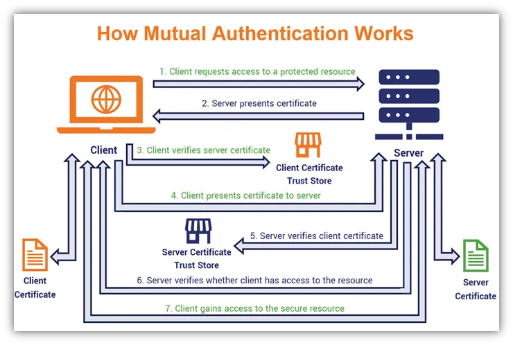

SSL 已经成为互联网最重要的基础设施，尤其是最近几年，基本上所有网站都已经部署了 HTTPS。曾几何时，SSL 证书对普通个人网站来说，还是很难取得的，主要是要收费。但是，从 Let's Encrypt 提供服务开始，几乎整个互联网都用上了免费的 SSL 证书。

使用 HTTPS 可以保证你的网站上提供的服务和用户浏览器之间的链接加密，其内容不必篡改和窃听。SSL 证书有很多等级，一般免费的证书都是域名级别的，即证明网站服务提供商，拥有目标域名的管理权限。当然还有更高级别的。

不过，一般的 HTTPS，只是帮助访问网站的用户认证自己访问的域名没有被篡改。但是在安全等级更高的地方，被访问的服务，也需要证明访问者的身份可靠。当然，一般的网站也都有这个要求，比如要求用户进行登录，提供用户名和密码作为一种验证手段。

## 客户端证书验证概述

但是在安全等级更高的场合下，光有用户名和密码，也还不够安全，比如你的用户名或者密码失窃了，别人就可以冒用你的身份。这时候，多因素验证就会成为一个重要的验证用户身份的手段。常见的是双因素认证，比如需要用户的手机验证码。

而客户端证书，其实也是一种多因素认证的手段。要求用户使用的客户端，必须给服务器出示证书，以证明自己的身份。仔细想一下，对每个人来说，可能也不太陌生。

比如，网络银行使用的 UKey 就是一种常见的客户端证书，证书被置于一个硬件设备中，通过 USB 插入到使用的终端上来提供给服务器。当然，除了硬件证书，还有软件证书。将 CA 颁发的证书，安装到目标的客户端，一般是安装到操作系统。这样，在浏览器访问目标服务器的时候，就可以从操作系统直接提供此类证书。

大家在使用网银的时候，其实已经远远不是双因素认证了，至少需要用户名，密码，短信验证码和 UKey，经常至少是三因素的。关乎到个人财产安全的网络设施，怎么小心都不为过。

## Web 服务部署客户端证书验证

作为非常重视信息安全的金融公司技术人员，我们一开始就非常注重保护公司的信息安全。公司所有内部网站，都采用了 HTTPS 作为基本的部署要求，同时，客户端证书认证，也是我们一直以来所要求的。

在 Web 服务器上部署客户端证书认证，是非常简单的。只要在 Nginx 的虚拟服务器配置上，打开选项：

```nginx
# 客户端公钥证书
ssl_client_certificate /path/to/root.crt;
# 开启客户端证书验证
ssl_verify_client on;
```

即可以实现对客户端证书的验证。使用 openssl 套件，自己构建 CA，然后将根证书配置在 Nginx 侧，即可以实现对签发的客户端证书进行验证。如何使用 openssl 套件，颁发客户端证书，这就是一个很长的操作指引，本文不在赘述，网上相关的教程很多，大家也可以看看 easyrsa 套件的文档或者相关介绍（应该是 openssl 的一个友好的命令行界面）。

## 移动设备环境下的客户端证书

Web 服务实现了客户端证书验证后，所有需要访问受保护网站的客户端，都要安装对应的证书。使用 openssl 生成的 x.509 证书，倒是可以在各种手机设备上安装，不过都是默认安装到操作系统的层面，然后手机操作系统官方提供的浏览器都可以正常使用。

但是，前不久，我们遇到一个场景，需要一个三方 App，也能够访问我们公司的内部网站，通过 App 的内嵌浏览器或者 WebView 实现访问需要客户端证书验证的网站。没有想到，这对我来说是一个不小的挑战。

场景是这样的，我开发了一款 App，是公司的办公网站 OA 的配套 App，通过 App 可以访问公司的办公环境。一般来说，我们的办公系统，是不需要客户端证书的，因为没有涉及到核心业务。不过我们给大家提供了一个很好的特性，就是使用 OA 系统统一登录去访问其他公司的内部网站，也就是常说的 SSO。而 OA 客户端 App 作为配套 App，自然带有将客户端身份转换为网页登录态的机制。所以，用 OA App 就可以免登录访问公司的业务网站。

在电脑上，这种 OAuth 授权是非常流畅的，因为 OA 的登录功能，只是代替了用户名密码这个输入环节，遇到需要使用客户端验证的业务网站，浏览器自然会提供相应的证书。

但是没想到，到了手机上，这变成了一个十足的困难点。在手机上，因为各种沙盒和隔离机制，想要从操作系统调用身份证书，变成了一个不可能的事情。这也是我经过很多的调查才搞清楚的事情。

我主要针对的是 iOS 开发环境，我就以 iOS 来举例说明这一点。我想，如果安卓的系统设计考虑因素差不多，那么阻碍也差不多。我需要用自己开发的 OA App 内嵌访问公司的一个核心业务网站，起因是通过 OA App 访问业务网站，可以免去输入用户名密码的步骤。但是，业务网站需要提供客户端证书才能通过验证。

我想到的第一个方案是，通过 OA App 来拉取系统里保存的客户端证书。这个证书保存在哪里呢？在 iOS 里，是保存在 KeyChain 里，这是一个 SecurityStorage 的概念。也是苹果操作系统提供的基础设施。怎么才能从 App 里调用到 KeyChain 里保存的证书呢？答案是，不能。

这么做的公司和开发者非常少，可见使用客户端证书验证这种手段的场景和开发者都非常罕见，所以能搜到的资料非常少。总算还是有一点点的。我发现，在苹果环境里，有一个叫安全组的概念，只有处于同一个安全组，才能访问这个安全组在 KeyChain 中的区域。那么，我们使用 Safari 浏览器安装的客户端证书，其实，必须要求你的 App 和 Safari 浏览器在一个组里，才能访问到。事实上，可能只有官方的 Mail App 才能访问这张证书。搞清楚这一点，就耗费了我大量的搜索时间。

第二条路，是自己在 KeyChain 里开辟一个区域，保存客户端证书，然后，在需要的时候从自己独享的存储里取得证书。似乎这才是唯一的正路。幸好我没去研究这一点。当然，自己在 KeyChain 里存储一张证书，似乎并不难。我使用 Flutter 开发 App，所以我找到了一些 SecurityStorage 相关的插件，似乎往里读写一些文件或者内容，并不是很困难，API 看起来就像是普通的 Key-Value 存储一样。知道这一点后，其实要搞清楚的还有两件事情，第一，怎么把一张证书存储到 KeyChain，第二，怎么从里面再读出来。

我们公司办法的证书是 p12 格式的，而且有密码保护。而 KeyChain 的存储，API 默认是存储一个数值或者对象。所以，这里就涉及到怎么把一个 p12 证书解密，然后转换成一个对象，存储到 KeyChain 里面。这个很难搜，真的。至少我是找了很久没有太搞清楚这个点。

于是我从另一点入手，就是假设我已经存储好了证书，那么在服务器要求我提供客户端证书的时候，我怎么提供。没想到，这也是一个巨大的难点。当然，我目前已经成功实现了，就不觉得很难，但是我反复搜索方案的时候，真的很绝望，几乎没有文章正经提及怎么实现这个需求。似乎每个人都知道怎么做，默认指点两个方向即可。而我追踪下去的时候，发现都没有进一步的文档和步骤指引了。

## WebView 很关键

其实，在 Flutter 里开发 App，很多关键性的对象，都是系统原生提供的，Flutter 必须通过 plugin 桥接才能调用。比如 WebView 这种对象，就必须有插件包装原生的 WebView 才能正常使用。

这时候，你选了哪种 WebView 的实现，决定了你怎么实现这个需求。我用的是一个 flutter_inappwebview 的插件，这个插件的选型可以说是有一定偶然性的。当时我开发 Flutter 还不熟，当时的搭档随手引入了。我也一直没有换。后来我经过了审慎的调研，发现，这几乎是 Flutter 开发中，最好用的 WebView 插件了，比官方提供的，Google Dev 团队的那个版本，要好用。

这个插件会提供一个叫 `onReceivedClientCertRequest` 的回调，当出现了客户端证书验证的请求时，插件会回调，但是我几乎没有搜到文档要怎么实现这个回调的内容。文档是非常缺失的，包括插件的官方网站，最后我只到了只言片语的指点。

你需要在这个回调里，返回一个 `ClientCertResponse` 的对象，这样插件会 handle 剩下的所有事情。看起来如此简单对不对，但是这么一句话的指导，也很难在各种网站找到。而且我至今也不确定这是不是唯一正确的方案，或者是最优方案。至少我知道这是一个可行的方案。

而构造这个 `ClientCertResponse` 对象，是很麻烦的，你会发现，构造函数要求你提供一个证书的物理存储路径，和一个密码。没有文档说明这个路径接受哪些格式的证书。大体上能猜到，使用一个 p12 证书是可以的，而且，正好 p12 证书也需要一个密码进行解密。但是，说好的 SecurityStorage 呢？那个东西的 API 里，可没有一个参数是 path。所以，等于是 KeyChain 的配套 API 和 `ClientCertResponse` 的 API 是几乎不匹配的，让人完全没有脾气。

## 一个临时的可用方案

这里我用到的方案，我坚信不是最优的方案，但是是我能力范围内，目前能找到的能流畅使用的方案。我使用了一个 `path_provider` 的插件，访问了 App 本地存储空间，将 p12 证书的文件下载到本地存储，然后将用户的证书密码存储在 K-V 中，这样，就可以满足 `ClientCertResponse` 的构造函数 API，提供一个路径和一个密码。

结果就是这么荒诞，研究了半天的 SecurityStorage，竟然根本没有用上。我也是很无奈，但是大家都懂，一个程序员第一步就是要先顶住，再优化。后续的东西，我只能慢慢研究了。

## 总结

客户端验证服务器的证书，而服务器也验证客户端的证书，这个行为模式，就叫做 mTLS，也即双向 TLS。在需要安全访问要求较高的场景下，是一种成本不是那么高的实现方案。

不过，通过此项目的实施，我发现，我们对 TLS 知之甚少，应用也不够深入，所以整个互联网能搜到的有效的经验和文档还不够多。给程序员抄代码带来很大的不便。所以进行此分享，以帮助更多的人。

目前，我文中提到的方案，还有很多的问题，只是一个勉强能用的方案，绝非最佳实践。比如，证书的存储是否足够安全？证书密码存储在客户端里，是否足够安全？第二，如果用户卸载了客户端，重新安装，则此前安装的证书就会丢失，这是否是一个期望中的行为？第三，文章中，我只提及了使用 WebView 进行客户端证书验证的方法，这只是展现网页用的。那么如何调用 API，例如，客户端调用 RESTful API，怎么进行客户端证书验证呢？我并没有提及，可以看看[这里](https://github.com/ysimonx/mtls-generator)。有人做了说明文档和 POC 的。

## 附录

### [在应用中使用证书和秘钥](https://developer.apple.com/library/archive/qa/qa1745/_index.html)（2014/09/17 QA1745）

问：**我通过使用 Safari 下载证书和私钥到我的 iOS 设备上进行了安装。但是，当我运行我的应用时，它找不到我刚刚安装的身份。为什么呢？**

答：用户可以通过在 Safari 中下载、作为电子邮件附件打开或使用配置文件安装数字身份（证书及其相关的私钥）到其 iOS 设备上。或者，身份可以从移动设备管理（MDM）服务器推送。但是，以任何这些方式安装的身份都将添加到 Apple 密钥链访问组（Access Group）中。

应用程序只能访问其自己 KeyChain 访问组中的项。这意味着 Apple 访问组中的项仅适用于由 Apple 提供的应用程序，例如 Safari 或 Mail。

要在自己的应用程序中使用数字身份，您需要编写代码来导入它们。这通常意味着读取一个 PKCS#12 格式的 blob，然后使用[证书、密钥与信任服务参考文档](https://developer.apple.com/documentation/security/1396915-secpkcs12import)中记录的 SecPKCS12Import 函数将 blob 的内容导入应用程序的密钥链中。

这样，您的新密钥链项将被创建为您的应用程序的密钥链访问组。

参考文档包含到“[AdvancedURLConnections](https://developer.apple.com/library/archive/samplecode/AdvancedURLConnections/Introduction/Intro.html#//apple_ref/doc/uid/DTS40009558)”示例的链接，该示例展示了如何在 iOS 应用程序中建立安全的网络连接。

通过电子邮件的方式提供身份的一种方法是，当您为设备提供设置时，向关联的用户发送一个电子邮件，附带客户端身份，以 PKCS#12 文件的形式附加。除了不给它标准的 PKCS#12 MIME 类型或扩展名，而是给它应用程序声明的 MIME 类型和扩展名。（扩展名“.p12”是由 iOS 声明的，不能被另一个应用程序声称。）用户随后可以打开附件，启动您的应用程序，在这一点上，您可以提供导入身份的选项。如果您将身份托管为 Web 下载，则可以使用相同的技术。

您可以在“[iOS 文档互动编程主题](https://developer.apple.com/library/archive/documentation/FileManagement/Conceptual/DocumentInteraction_TopicsForIOS/Introduction/Introduction.html#//apple_ref/doc/uid/TP40010403)”中了解更多有关声明文件扩展名的信息。

### [怎样在应用中得到客户端证书？](https://developer.apple.com/forums/thread/120463)（2019/07/26）

（略）此问答也给出了一些信息，不过内容类似，我就省略了。

### [处理认证挑战（Handling an Authentication Challenge）](https://developer.apple.com/documentation/foundation/url_loading_system/handling_an_authentication_challenge)

介绍了当服务器要求对URL请求进行身份验证时，适当做出响应。苹果官方文档，介绍了，如何响应服务器的证书要求。

### [问题编号152584：Chrome不支持在系统根存储中安装的客户端信任根证书](https://bugs.chromium.org/p/chromium/issues/detail?id=152584)（2012-09-27）

……

能够访问系统根存储是不公开的API - 它隐藏在SecTrustEvaluate的实现细节后面。iOS密钥链API仅提供访问每个应用程序密钥链的权限，而无法列出或迭代系统密钥链。

由于“添加证书”也可用于配置客户端证书，因此由MDM / iCU添加的客户端证书存储在一个由苹果限制的密钥链访问组中，可供所有苹果系统应用程序使用，但无法供任何第三方应用程序使用。

……

【以上，在 Chrome 浏览器里(特指 iOS 版)，无法应对服务器的客户端证书挑战，现在(2022)十年过去了，似乎仍是同样的问题，我们使用Google Worksapce，如果通过 MDM 下发证书等，可以在 Chrome 浏览器实现安全并一致的体验，但是因为苹果这个障碍，变得不可实现了。下发私有信任的根证书和客户端证书，都不可能，甚至手动在 Chrome 里安装客户端证书都没有找到什么方式，估计 Google 也放弃了吧，毕竟企业应用只是个小众的领域，用 Safari 能做好的，何必费力呢？】

### [iOS 上的客户端证书处理](https://medium.com/nerd-for-tech/client-certificate-handling-on-ios-f704d896cccd)

这篇文章也提及了，在 iOS 上，App 如何处理客户端证书的问题，老哥甚至开发了一个 demo，录了视频来讲解怎么实现这个事情，不过是 iOS 环境开发的，有一定的参考意义。

他引用的插图不错，很好地阐释了整个 mtls 的过程。我就也贴过来好了。

