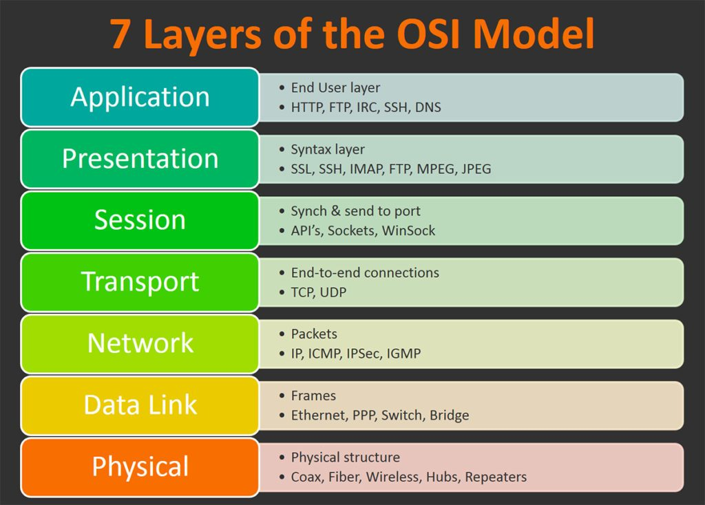

最近我遇到一个难题，我在阿里云买了一台服务器，用它搭建了一个“获取全世界互联网信息的服务”。我家用的是电信宽带，使用起来非常流畅，但是莫名其妙的是，在公司就不能很好地运作。公司用的也是电信的宽带服务，是写字楼园区专供的企业电信宽带服务。

跟公司的 IT 抱怨很久，他们也没法解决，说我对服务器发出的请求，是从离开公司端口后开始丢包的，只能去投诉运营商，这个借口真好，原因是什么也没法查，解决当然也无法解决啦，好，不去管这些烦心事情了。

后来我同事告诉我一个神奇的工具，以及解决方案，终于曲线救国了。我把阿里云服务器上的服务，桥接到我家里，然后在公司的时候，我就连接到我自己家里的服务器。为了保持家里和阿里云的可靠连接，我需要搭建一条可靠的隧道。这里就用到了一种ARQ协议。我以前不知道什么是ARQ，今天看了一下维基百科，觉得还是很有意思的，本文就介绍一下什么是ARQ。

## 要记住：重要的事情说三遍

ARQ 的全称是 Automatic Repeat reQuest，不要问我为什么选择这三个大写字母，我也觉得选择很奇怪，估计大写缩写有一定的规则吧，我并不了解。但是从字面意义上看，就是说，把请求自动再发一次。就好像，你跟别人说话，那人没听到，你就再说一遍，一直到他听到为止，这就好像是我们开玩笑的：重要的事情说三遍一样。只是一个比喻。

从这个名字里，我们可以了解到另外一件事情，ARQ 虽然被称为是一种协议，但是定义里看更像一种策略，或者一种解决方案建议，具体怎么去实现，还是有多种办法的，也有很多的变体，后面会说到这个问题。

> ARQ，也可以是 Automatic Repeat Query 的缩写，是一种在数据传输时，使用确认（_Acknoledgements，就是我们常说的ACK，接收方发送一个消息，告诉发送方，自己是否正确接到了一个包体_）和超时（_Timeouts，在收到一个确认消息之前，等待的一个确定的时间段_）机制，在不可靠的网络上，实现可靠的数据传输的错误控制方法。如果发送方在超时之前没有收到确认，通常会重新传输相应的包体，直到收到确认或者重试超过一定的次数。
> 
> [维基百科 Automatic Repeat Request](https://en.wikipedia.org/wiki/Automatic_repeat_request)

祭出此图：ARQ 一般在数据链路（Data Link）和传输（Transport）层实现

## ARQ 的常见策略

ARQ 协议有很多种常见的策略：

*   **停止并等待 ARQ（Stop-and-wait ARQ）**：这是最为简陋的一种ARQ实现方式，用于远程通信的两端，保证消息传送没有缺失和按序到达。一句话概括这种策略，就是每说一句话，都要等到确认才说第二句，否则就一直重复上一句。很显然，这种方式就是串行发送消息帧，而且要等待确认才继续，一帧内容传送就要最短等待一个往返消耗的时间，有时候还要加上超时，所以效率非常低下，速度也非常慢，实现起来很简单。这种协议很容易出问题，比如，接收方的确认消息丢失了，或者确认太慢了，导致了发送方等待过久，发送方就会重发，结果接收方就收到两个一样的帧，这时候，接收方就没法确认，到底是上一帧重复了，还是又来了一个新的帧。发送方也可能会收到两个确认，无法识别是重复确认同一帧还是不同。于是，这种协议会在头里加上一个比特（bit）的序号，取值只有 0 或者 1，接收方收到的时候，是按照 010101…… 这样的交错顺序的，否则就是重复帧，简单丢弃就可以了，发送方收到的确认也带序号，采用同样策略处理。所以，这种 ARQ 也叫做“翻转比特协议”（alternating bit protocol）；
*   **后退N帧 ARQ（Go-Back-N ARQ）**：这种协议相对上面一种来说，其实利用了统筹的思想，这种策略下，发送方在等待超时的间歇，可以继续发送数据帧，可以连续发出的帧数量，叫窗口大小，显然窗口大小的设定和超时时间，数据传输速度匹配，是比较优化的选择。同样，所有发送的帧，都要带有序号，接收方严格按照序号收纳数据帧，先收 1，再收 2，如果这时候 3 丢了，来了一个 4，那么接收方会丢弃。同时，接收方每收到一个帧，都要确认一个序号，就是自己收到的有效的最大序号，在这个例子里，接收方一直确认 2。发送方在发完一个窗口所有的帧以后，检查最大的有效确认，然后从最大的有效确认后面一个开始重发，比如上面的例子里，发送方已经发到 8 了，但是因为最大的有效确认只有 2，那么必须从 3 开始重新发送。其实，TCP 协议，使用的就是这种 ARQ 策略（变体）。从这个机制的原理可以看出来，这个协议的特点，有一个滑动窗口，但是这个窗口只对发送方来说存在，接收方只是一帧一帧处理数据，所以，仍然存在很多的浪费，一些信息会反复发送多次。如果把收到的不想要的帧，先缓存起来，说不定将来会用到，就可以提高效率，这就引出了另一种策略；
*   **选择性重发/拒绝 ARQ (Selective Repeat/Reject ARQ）**：其实理解了上一种，这种就很容易了，就是把收到的非预期帧缓存起来，然后告诉发送方自己缺哪一帧，服务器不会连续重发，而只发送接收方缺失的帧，如果接收方续上了编号，就快速向前跳动编号，这样极大减少了数据的重复发送，提高了效率。

回退N帧 ARQ（a）和 选择性重发 ARQ（b）的原理图  

## 总结

ARQ 是一种在数据传输过程中，错误控制的策略，保证了数据的完整性和顺序性。核心目的是在不可靠的网络上实现可靠的数据传输。比如，在短波无线电传输，GSM 网络，电报等领域都有很广泛的应用。在当今因为各种原因导致的复杂互联网环境上，某些点对点传输的服务，也变得不那么可靠，可以考虑引入 ARQ 策略。

在服务器端开发方面，ARQ 的思想，也可以给我们在服务实现时候，很多的启发。此外，这种策略的学习和理解，也是理解更复杂的网络协议的基础。