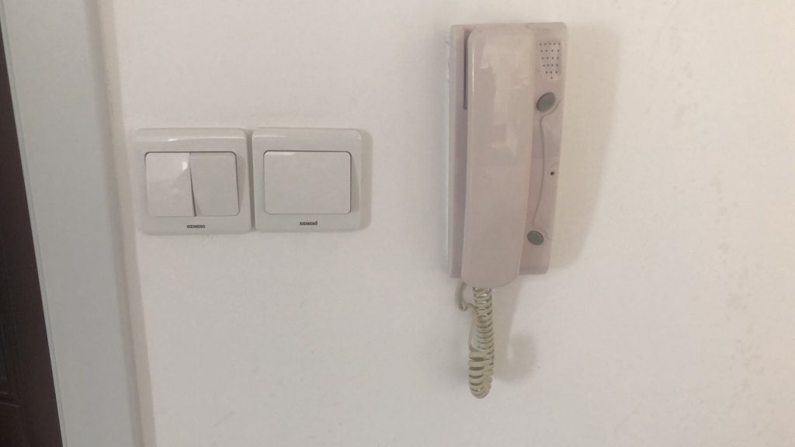
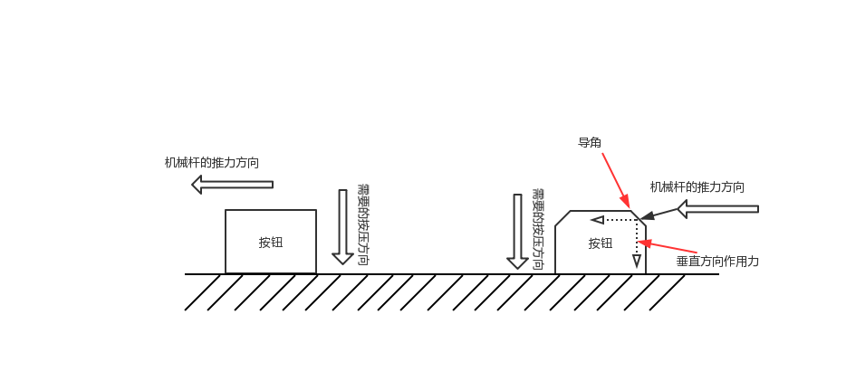
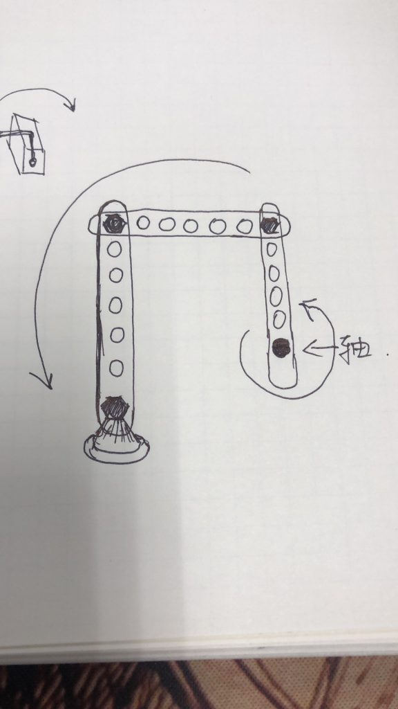
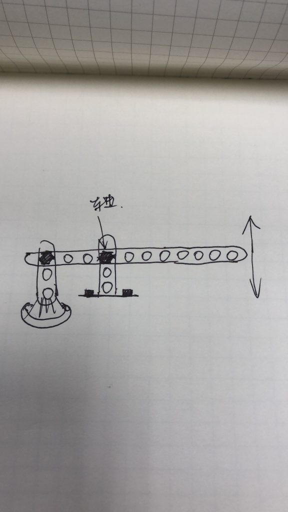
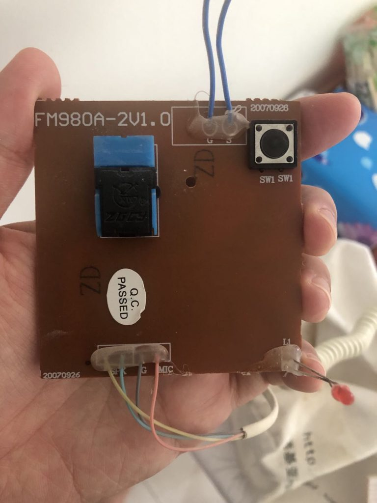
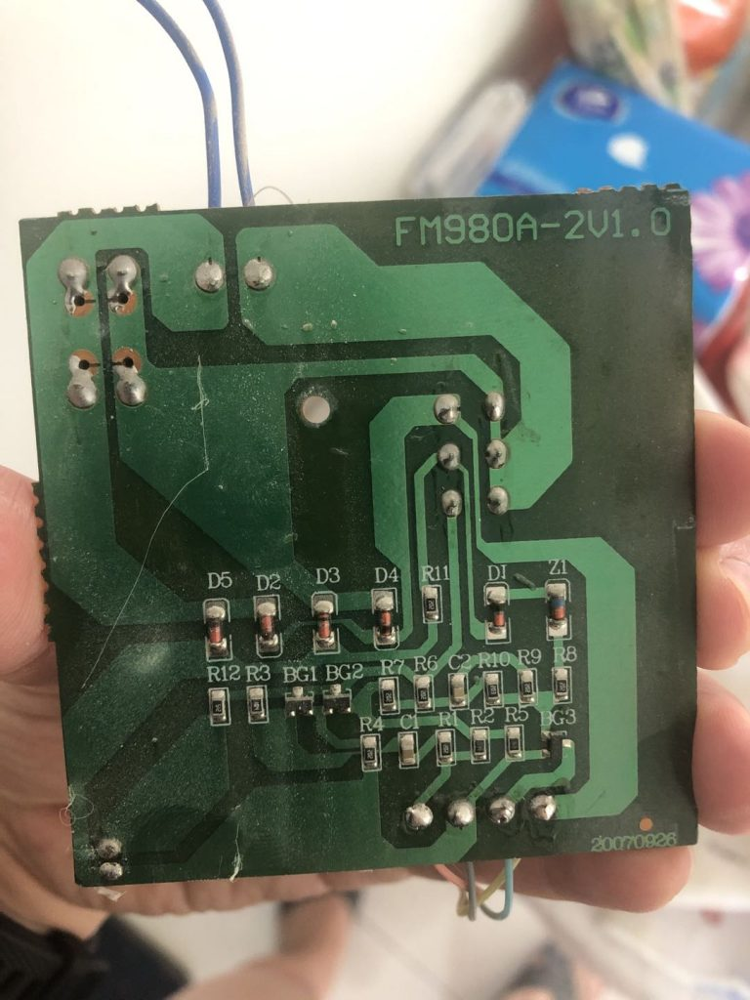
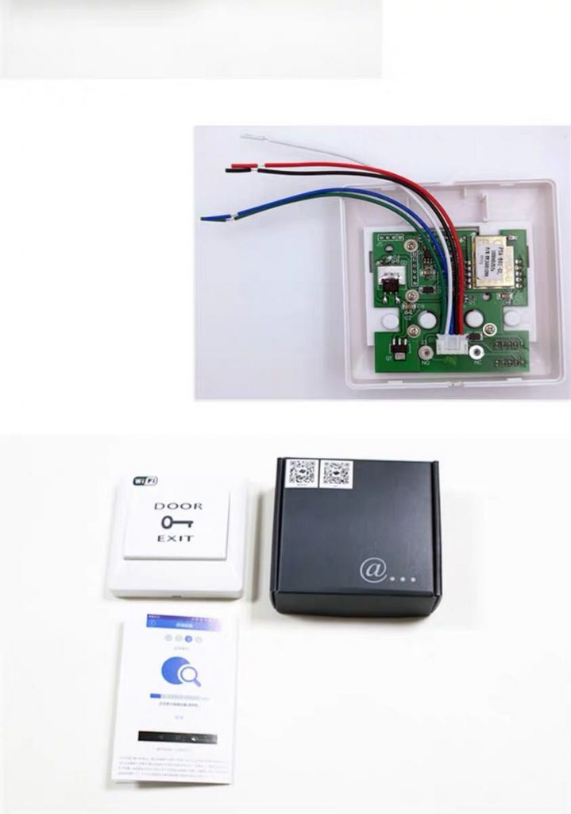
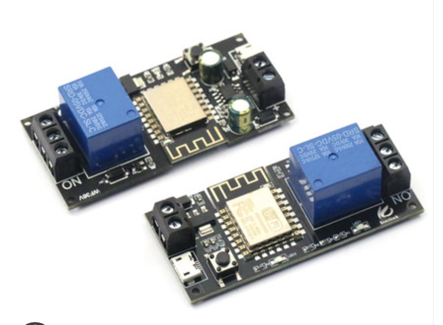
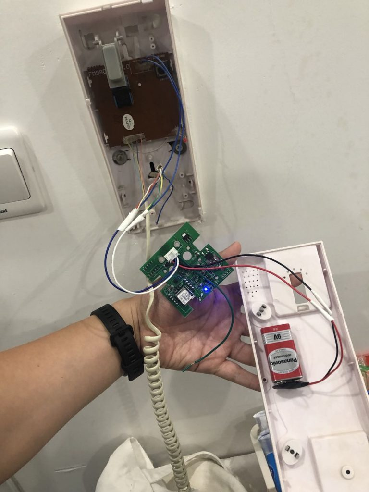
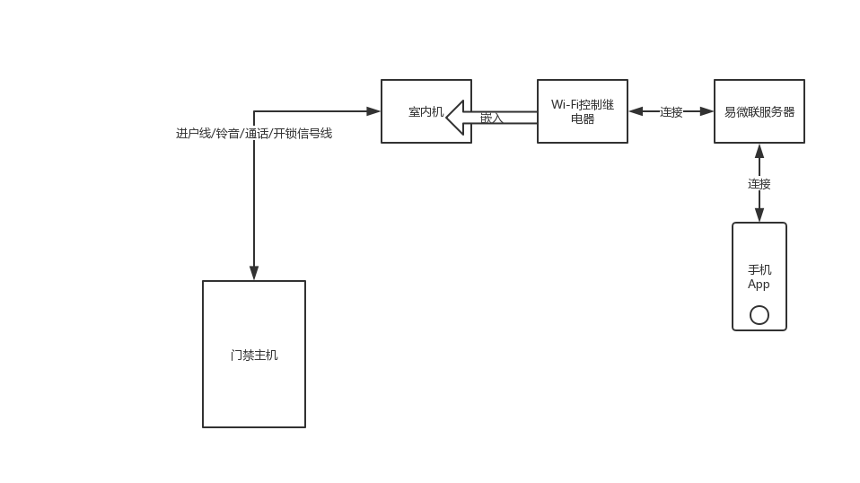

之前，在北京体验了一次智能门锁，可以用密码开门，不用钥匙，觉得好方便，一冲动，就把家里的锁换了，选了京造智能锁（当时随便找了个最便宜的，买下来 789），可以用指纹、密码、ID 卡、钥匙多种手段开门。更换异常顺利，从此少了一把很大的钥匙，感觉特别方便。这时候，我发现楼下单元门的门锁，还是需要使用钥匙或者 ID 卡才能开。我出门还是不能空手。

不过，楼下单元门上有个对讲门铃，按了房间号码以后，会唤响室内安装的一部对讲话机，接听后，按开锁键，就可以打开楼下的门锁。我就想到，能不能按一下我自己家的门铃，然后，用手机 App，通过网络控制，完成开锁的动作。这样，我出门只要有手机，就可以了，不需要钥匙或者 ID 卡。

## 机械方案，误入歧途

楼宇门禁室内机的样子

先给大家看一下，楼宇门禁系统的室内机的样子，看起来就像一个电话分机一样，一般安装在家里门口的位置。上面有一个按钮，开锁键。这个东西的淘宝名称叫做“楼宇门禁非可视对讲室内机”，这个名字我也是折腾了很久才搞明白的，免费赠送给大家了，这年头搞清楚搜什么很重要。

想要手机控制开锁，就要想办法按下那个按钮，我想起以前在微博上看过一个人发的小视频。

在微博上看到过一次这个小视频

这个视频里展示了一个手机控制的机械杆，机械杆转动，形成了一个按压按钮的效果。显然，我遇到的问题有人遇到过，也有人解决过。当我想到要开门的时候，刚好想起了这个视频。废了一番力气，从历史记录里翻出来了。

这个方案，是一个通过网络控制一个机械的外挂的方案。想到这个方案以后，就开始研究人家怎么做的。其实，玩这一套，是一个领域，叫 IoT，意思是 Internet of Things，中文叫“物联网”。图里使用到的那个机械设备，核心部分是一个电机，这个电机的淘宝名称叫做“舵机”，更加正式的名字叫“步进伺服电机”，本质的原理是，通过脉冲信号的数量，来控制电机转动的角度，实现比较精确的控制。因为用在飞机模型，或者船只模型里面，用来控制舵板之类的装置，得名为舵机。

图里的方案，大概使用了一个叫 Node-RED 的解决方案，大概是一个嵌入式开发板，封装了比较高级的语言（NodeJS）和开发环境，方便玩家快速开发出如是视频中的解决方案。

这个方案看起来轻巧，无侵入（不破坏原来的设备），轻便。但是，并不是全无缺点。对我来说，最大的缺点就是门槛比较高，光是搞清楚视频里的这些东西叫什么名字，淘宝怎么买，就花了不少精力，看得见，叫不出名字，越来越普遍了。另外，视频里可以看出来，电机带动的机械杆，是水平转动的，但是按钮是垂直按压的，那么水平扫动，怎么才能转换成垂直按压呢？

力学原理示意图

上面的那个方案，如果想要同样效果，需要一个前提条件，就是你要按压的按钮是带有导角的，不然的话，就不能用视频里的方案，然而，非常不幸的，我家的那部室内机，开锁按钮是圆柱形的，侧面看上去，就像图里左边的形状，没有导角，也就无法通过水平扫动得到一个垂直方向的作用力。

我能想的办法，只能直接产生一个垂直方向的作用力，一开始我思维定势在舵机上面，就变成了如何把舵机输出的扭矩转换成垂直按压的作用力，可能需要一套连杆齿轮之类的经典机械结构，简直痛苦，我并不懂这个。

空想方案一

空想方案二

我想了各种空想方案，但是，发给小伙伴，他们都看不懂我在说什么，所以，读者你看不懂，也没什么，不是你的问题：D

后来一个对机械有点知识的同学告诉我，还有一种设备，是集成好的电动液压杆，才打开了一个新的大门，原来还可以用液压杆，直接能产生一个方向的作用力，还足够大，没有扭动转换按压的问题，也没有力矩杠杆问题，不用考虑功率问题。

但是终究还是太过麻烦了，想想就头皮发麻。乱七八糟一堆，怎么安装？怎么固定？怎么供电？主控怎么连接？全都没有头绪，需要太多知识了。所以，这个阶段，全部停留在空想，我没有任何行动，仅限于搜淘宝和思维试验，以及群里和小朋友讨论。

## 弱电电子方案，看到了希望曙光

外挂一套机械装置可能还是太过麻烦了，而且稳定性实在是堪忧，以至于，整个项目陷入了僵局。有一天，我一个人待在家里，实在无聊，我就开始拆卸门上的那个室内话机，打开一看，竟然也没有那么难以理解。

非可视对讲室内机-电路板正面

非可视对讲室内机-电路板背面

看到这个电路板，我惊呆了，没想到如此之简单，以前我严重高估了困难性。从电路板正面，我们三个元器件和 6 根线，很好理解，信号进入线，顶部两根蓝色的，（震惊它的精巧，竟然只有两根），下面 4 股线是听筒，可以想见，里面是麦克风和扬声器。右上角是开关，左边是挂机的按钮，右下角是一个二极管小灯。

就算我电路知识全部还给老师，我仍然能理解到，开关的本质是一种短路，那么输入信号线只有两根，又直接连接了开关，从背面可以看到（这是一个单层 PCB 电路板，非常简单，看到的就是实际的情况）。可见，开锁的原理，极其简单，就是短路输入的两股信号线即可。也就是说，我们需要的东西是“通过网络控制的开关”，或者类似的东西。一个同事告诉我，叫“继电器”。

于是开始了新的搜索旅程，开始在淘宝找 Wi-Fi 门禁开关，或者继电器。于是，我找到了这么一个东西：

淘宝找到的智能 Wi-Fi 门禁开关

其实，继电器我也不是没有找到过，大概长什么样子呢，看下面的图：

Wi-Fi 智能继电器模块

我为什么买了上面的那个集成好的开关，而没有买下面的继电器模块呢，原因可能是我的个人洁癖。这个模块上面的蓝色的东西，就是继电器，从参数看，能支撑 250V 电压 10A 电流，而我想开关的线，无非是那么细的两根线，可以猜到，上面根本不会有什么电压或者电流的。那我为什么要用一个强电的继电器，去控制一个弱电电路呢？（这种洁癖是病，得治）

上面那个集成好的开关，显然也是一个 Wi-Fi 芯片加一个继电器，不过显然是一个弱点继电器，就显得非常小巧。而且，一体化集成方案，也非常紧凑。就是价格差距有点大，上面的要 98 块，下面的模块只要 30 多。

## 要想解决问题，还是要穿透很多迷雾

一个插曲，我买那个开关的时候，店家问我要怎么玩，我说了我的想法。淘宝小二告诉我，说不行的。我说，你估计不懂电子电路吧，你就告诉我一下，图里的几根线，分别干什么，以及怎么给这个电路板供电就行了。她很负责的要电话联系我，电话里，非跟我说不行的，说那个开关，只能安装在主机的附近，不能安装在室内机，肯定不起作用的，她亲自安装过。我问她，你安装过不起作用的原因是什么，你是否真的懂呢？她斩钉截铁说，她当然懂，她卖这个吃这口饭的，很了解。然而，我问不起作用的原因，终究是没说出来。

你要干一个事情，人家告诉你不行，然后，你可能要冒一些损失的风险，比如退换货的成本，时间浪费等等。但是，我想，这个东西的原理我应该是看懂了的，不太会错，她虽然说不行，拼着损失 100 块，我也要试一试好死心。

卖家终究没讲明白，这个东西怎么供电，但是给我发来了安装图，配合宝贝页面的图示，果然这个东西都是只介绍怎么安装在主机附近。很多公司玻璃门，都用的这种按钮，进门的时候刷工卡，出门的时候按一下按钮，门就开了。

所以，我只能去查一般的楼宇门禁系统的规格。对，关键词是“楼宇门禁”，这也是一个要命的关键词，你说不对，很难搜。我发现，大多数楼宇门禁的直流电供电箱，规格都是 12V1.5A，我就猜那个开关既然设计为和门禁主机共享电源，可能接受的是 12V 电源。想想，这东西还是能解决的，我要想办法使用 12V DC 供电。

东西买到手了，我才发现，我并找不到一个 12V 的直流电源。我手上最多的东西是充电宝，USB 线之类的东西，这类如无例外都是 5V 的直流电供电。我剪断了一根 USB 线，抽出正负两极，尝试驱动这个开关，发现根本无法点亮，可见 5V 是肯定不行的。

正好，我有一个喜欢玩嵌入式的小伙伴同事，他很热心帮我分析我买的这个 Wi-Fi 开关，我们分析电路板上的元器件，发现 Wi-Fi 主控芯片在网上非常流行，几乎是这类设备的事实标准，这个 MCU 芯片的标准电压是 3.3V，电路板上的继电器芯片，也搜索到了，供电电压是 5V，那么为什么 5V 的直流电拖不动呢？

我们又发现了上面有两个 DC-to-DC 的电压转换芯片。我们猜测，第一个是把 12V 转成 5V 的，第二个是把 5V 转成 3.3V 的。所以，只接受 12V。到这里，我就问高手，我说，这个电压转化，是什么原理，是把高于 5V 的都降低到 5V，还是只能把正正好好 12V 变成 5V？他回答我说，是把高于 5V 降低到正好 5V。当然，高出的部分是有极限的，太高的电压就直接击穿了。那么就有了一个大胆的猜测，只要供电高于 5V，这个东西就能跑起来。高手说：善。

然而我还是没有高于 5V 的直流电。你看，走了那么远，最后被这种事情绊住。结果，高手突然跑过来雪中送炭，接济了我一块 9V 的干电池。这个我也见过，竟然从来没想到过！（后面再说高手为啥这么热心）

我于是用 9V 电池直接测试了那个开关，点亮了！让我无比兴奋！虽然，离成功还很遥远，但是我觉得已经超过 50% 的概率了。

## 首次测试成功，我高兴得跳起来了

得知可以用 9V 电池点亮以后，怎么安装，以及怎么确保稳定运转就成为提上日程的事情了。从上面的图里，可以看到，我买的是一个 86 盒，就是家里一般的那种开关插座面板的规格。如果家里事先掏好一个洞的话，安装就简单了。只剩下了走线的问题了，如果没有洞，就比较麻烦。

同事建议我安装明盒，这个大家去淘宝搜“86 明盒”，就知道我说的是什么，明盒的麻烦是，要凸起一大坨。而且，可能还要在墙上打眼，膨胀螺丝等等问题。

我也是犹豫了很久，后来觉得，还是先试验成功再做决定。回了家里，我打算接线，发现这个电路板其实很小，就想，能不能干脆塞进那个话机的外壳里面，舍弃这个 86 的面板。反正我要的只是遥控开关功能，实体按钮话机上本来就有一个了，再多一个也不是特别有必要。

拧下来一比划，真的可行。于是我就开始了安装。

将电路板拆下来直接放入室内机外壳

反正 9V 电池可以驱动，我就想到，把电池也放进去，图里就是我的安装过程，电池用双面胶贴上，然后电路板塞进。

[embed]https://v.youku.com/v_show/id_XNDMwNTY1MjMwOA==.html[/embed]

上面的视频就是我塞进去以后的效果，然后，我热血沸腾地跑到楼下去按门铃试验了。

[embed]https://v.youku.com/v_show/id_XNDMwNTY1OTc4MA==.html[/embed]

成功了！我觉得无比振奋，高兴得手舞足蹈。整个事情到这里其实就告一段落了，从想到这个点，到痛苦的寻找，最终还是被我做出来了，而且安装到了话机的里面，简直完美！虽然从 IoT 这个领域，或者从智能家居这个领域来说，我这个东西还是很简单的一个小东西，不知道为什么就是很有成就感。

## 最后的困难，供电

到上面那一步，我高兴得睡不着觉，四点多才睡下。心里唯一的忐忑，就是那个电池能用多久。想起来专家跟我说过，Wi-Fi 模块比较费电，恐怕难以为继。我睡前就在思谋这个事情，如果一节电池可以撑很久，我以后就用电池方案了。

然后我就想算个账，一个电池大概能用多久。已知，Wi-Fi 模块待机 0.1W，Wi-Fi 芯片的电压 3.3V，电池设计容量是 400mAh。根据公式 Q = It，电量等于电流乘以时间，再根据功率公式 W = IV，可以算出来待机电流是 30mA 左右，那么理论待机时间是 400mAh 除以 30mA，才 13个小时！

算出来这个又阴云密布了，早上 9 点我起床一看，已经没电了，毫不意外，因为就算达到理论值，也只有 13 小时，我还没算电路和服务器相连心跳的耗电，还有之前点亮后，反复配对几次的耗电，撑到早上没电，实属正常啊。

搞了半天还是要解决供电。

后来我去淘宝买了一个 12V 的直流电源插头，是以前斐讯盒子的电源转换器，然后又买了10米的延长线，从我的弱电箱一直延伸到门口的室内话机里面，用电烙铁在话机的外壳上烫了个洞，把电线伸进去，直接从交流转直流给这个智能模块供电，总算是全部搞定了。

[embed]https://v.youku.com/v_show/id_XNDMwNTgwMTQzMg==.html[/embed]

## 软件部分，智能助手的连接

整体解决方案完整原理图

折腾了很久，总算全部搞定了，最后在家里走了5米多的明线有点不够完美。不过第一次从调研，设计到最后实现，能完全搞定，并且稳定可靠，我已经很满意了。

一直没有提及软件部分，这里简单提一下。我买的这个开关，用的 Wi-Fi 芯片，是圈里非常流行的芯片，很多 IoT 设备都是用的这款，这家开关集成的芯片背后的厂商叫易微联，也生产很多其他智能设备。我只是把一个智能门禁开关改造了一下和家里的门禁室内机相连了。

然后，很惊喜发现，易微联作为三方厂商，和小米的米家智能也可以联合，就赶快把这个开关绑定到了米家。虽然在米家里没法直接操作，但是可以通过语音来操控，我可以喊“小爱同学！打开门铃开关”，这样，就可以响应门铃，自动开门了，以后人在家的时候，只要喊一声就可以了，不用跑过去门口开门。

而从外面回来，可以用手机遥控给自己开门。非常方便。

## 总结，以及还有什么可能

这次的项目完结，我感觉是对我这么多年来知道的各种电子，计算机，软件知识的一次大盘活，还有动手能力，设计能力等等，非常有成就感。

中间我做的过程种，给我支招的那个高手同事，听了我的想法，他自己也心动想搞一个，不过最后他用了跟我不同的方案，一看他就更有经验一点。他买了一个 433 遥控弱电继电器（整套方案 20 以内）。433 本质上是一个射频的频率，433MHz，常见的遥控器使用的频段，比如遥控车库门，单位会议室的遥控投影幕布，遥控电风扇之类的，可能是红外的，也可能就是这种 433 的。

这个模块非常小，比一元硬币还小，相应的其功耗也极其低，不支持 Wi-Fi 和智能，这带来的好处是，一节 9V 电池，可以供电几个月到半年。而且方案简单可靠。很难坏掉。也不担心停电。

怎么解决 Wi-Fi 控制呢，可以用一个树莓派之类的小型机器来遥控那个 433 模块的遥控器。这样，也可以解决智能的问题，后来他买到了一个可以和天猫精灵结合的设备，通过天猫精灵控制，也可以语音控制。

如果计算完整功能的成本来看，我的整套方案在 130 左右，他的方案算上天猫精灵的部分也差不多 100 多，成本差距不大。我的方案集成度高一点，但是没有他的方案简洁。他把遥控和智能拆解成两部分来实现，遥控那一侧尽可能简单可靠，低功耗。智能那一侧就有各种办法。各有所长。不过我个人反思一下，可能他的方案更好一点。毕竟是专家，经验丰富了。