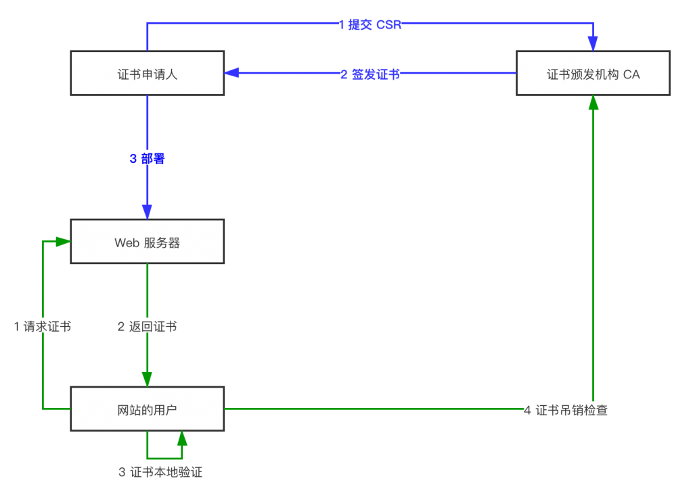

当年，刚开始玩网站的时候， SSL 证书还是很难获得的，只有少数几个机构支持颁发免费的证书，所以我们只能自己签名一个证书，来部署 HTTPS，但是，自签名的证书不会被浏览器承认，12306 刚上线的时候像个骗子网站，就是因为它用了自签名的证书。

后来，有了救世主，就是 Let's Encrypt，面向全网颁发免费证书，无条件的。截止目前，全网已经有 1.9 亿网站部署了 Let's Encrypt 的证书。我以为，我这辈子再也用不到自签名证书了。哪知道，还是让我碰到了，用自签名证书更方便的场景。

## 场景

这里也顺便说说我的场景好了。第一次遇到非要自签名场景是公司里部署企业内网安全的时候。咱们访问一个网站的时候，一般是服务提供商，需要部署证书，我们作为个人用户，需要通过公信力机构，认定我们在访问的服务，使用的是合法获得的证书，且我们的通信是加密的。在公司，内网网站，还需要对访问者进行验证，不是谁都能看公司内网的，必须是公司的员工才行，怎么确认这一点呢？一般我们使用密码，更进一步，只有登记在册的设备才能访问公司的内网网站，那么就需要用到客户端证书。大家，平日里用的客户端证书的场景很少，一般只有访问网银的时候，才用客户端证书，也就是 UKey，原理是一样的。

颁发客户端证书，目前，全网免费的服务非常少，既要免费，又要可以信任的，就更难找了。所以，我们当年采用这一方案的时候，不得不使用自签名证书。

第二次就是最近，我是一个个人开发者，想要做一个 Telegram 机器人，这就需要跟服务器通信，比如，设置 Webhook 之类的，现在这类需要去服务端注册的回调，都要求强制 HTTPS 了，微信的公众号也是需要 HTTPS 的。这里，其实 Let's Encrypt 是可以解决的，不过我想在本地电脑搭建一个开发环境，让服务器的回调发到我的本地，这样，我开发调试起来非常容易，那就不那么容易解决证书的问题。所以，我想到了，还是弄个自签名证书方便，反正只是在开发环境用一下。

## EasyRSA

EasyRSA 是 OpenVPN 社区旗下的一个自项目，专门用来搭建一个 CA 的全部命令行套件。其本质是一套 shell 脚本，里面真正起作用的是 OpenSSL 的命令。如果，你非常熟悉的话，直接用 OpenSSL 也是可以的。

现在进入主题了，接下来本文介绍如何使用 EasyRSA 创建一个 SSL 证书。

### 下载安装 EasyRSA

因为是一款 shell 软件，本质上下载后解压就是安装完毕了：

```shell
# 去 GitHub 下载最新 Release 现在是 v3.0.6
curl -OL https://github.com/OpenVPN/easy-rsa/releases/download/v3.0.6/EasyRSA-unix-v3.0.6.tgz
# 解压缩
tar xf EasyRSA-unix-v3.0.6.tgz
cd EasyRSA-v3.0.6
```

然后，我们可以看到一个 `easyrsa` 可执行文件在目录里，已经安装完毕了。

### 创建证书颁发机构 CA

接下来就要创建证书颁发机构了，这里有个小技巧，介绍一下，就是等下可能会在目录下生成很多文件，你可能会搞不清楚，生成了哪些，可以现在提前把整个目录变成本地 git 库，提交所有文件，然后一旦有新文件生成了，就很容易分辨。

```shell
# 第一个命令，初始化公钥基础设施（Public Key Infrastructure）
./easyrsa init-pki
```

公钥基础设施（PKI），是一个安全体系，也是咱们整个互联网的安全基础，我们接下来要讨论的一些概念，都是这个体系内的角色，所以，无论要扮演哪个角色，都需要先拥有一个 PKI。



图注：**_PKI 的简易版流程_**

初始化好 PKI 后，我们会发现，多了一个目录，叫 `pki/` 里面有两个目录，一个是 `private` 显然，里面将要存储私钥了，另一个目录叫 `reqs/` 看起来，要存储申请（request）了。

第一个，要扮演的角色是证书颁发机构（Certificate Authority）也就是我们说的 CA：

```shell
# 创建 CA 的时候，可以不使用选项，这里开启了一个 nopass 的选项，作用是，创建的 CA 不使用密码保护自己最重要的私钥，因为咱们是在玩开发环境嘛，如果是用于生产，还是需要密码保护的。
./easyrsa build-ca nopass
```

创建过程中，会问你要 Common Name，你可以输入一个英文句号 . 来表示留空，我输入了自己的名字 Charles，哈哈 :D

创建好 CA 后，我们在 `pki/` 目录下，看到一个 ca.crt 这是 CA 的公钥，在 `private/` 目录下，有 ca.key 这是 CA 的私钥，也是一个 CA 最要命的东西了。还有其他一大堆的文件，先不要管了。

### 创建申请表 CSR

刚才也简单介绍了 PKI 是怎么回事，也说到，在这个体系内，会有好多个角色，第一个角色，就是证书颁发机构 CA，然后，我们的目的是得到一张服务器证书，现在就要扮演另一个角色，就是**证书申请人**。

```shell
# 作为证书申请人，也是需要先初始化 PKI 的，当然，因为咱们全在同一台电脑上，就没必要这么做了，因为上一个步骤，已经有初始化好了一个 PKI 了
./easyrsa init-pki
# 接下来，要创建证书签名申请 CSR（Certificate Signing Request），咱们这里又用了一个 nopass 的参数，开发环境噢。Demo 只是一个名字而已，无所谓是什么。
./easyrsa gen-req DEMO nopass
```

这里应该比较容易理解吧，有一个证书颁发机构，申请人，先填写一个申请表，接下来拿去机构盖章（签名），于是就签发了一个证书出来。

这个脚本的执行过程中，会问及你的 Common Name，这个时候，如果证书是要用于网站的域名证书的时候，应该在这里填写上网站的域名。

### 导入申请

继续咱们的角色扮演游戏，咱们现在又要扮演回 CA 的角色了。申请人已经填写了申请表，接下来，提交了申请。作为 CA，我们收到了申请人的申请，需要将申请导入系统：

```shell
# 还记得上面初始化 PKI 的时候，我们说了一个 reqs/ 的目录吗？申请表在那个目录里
./easyrsa import-req ./pki/reqs/DEMO.req HelloDemo
```

上一个步骤，我们把 CSR 取名为 DEMO 了，所以，这次我们把第二个参数取名为 HelloDemo，为了跟刚才那个名字不一样，然后你就能看到比较好玩的，`pki/` 目录下，除了 DEMO.req，又多了一个文件叫 HelloDemo.req，我有一个大胆的想法不知道当讲不当讲，哈哈哈，你猜对了，这两个文件一模一样，因为一般来说，证书申请的时候，CA 都不会是你自己的电脑，现在同一台服务器，扮演两个角色，就搞笑了，左手导入到右手，根本一回事嘛，所以，上面这步，在同一台电脑上是多余的。可以根本不做。只要你记得，你想签名的那份申请是叫 DEMO 就可以了。

### 签发证书

既然演戏，我们就演到底，咱们现在继续扮演 CA，需要给刚刚导入的 HelloDemo 签名了：

```shell
./easyrsa sign-req server HelloDemo
```

命令倒是简洁而且干脆啊…… 执行完毕后，证书就签发完毕了，在 `pki/` 目录下，多了一个叫 `issued/` 的子目录，里面存放了签发的证书，HelloDemo.crt，有效期默认是 1080 天。私钥就是前面生成 CSR 的时候，在 `private/` 目录里的 DEMO.key。到此，我们需要的自签发网站证书就生成完毕了。

## 证书部署

生成好证书以后，我们就要把证书部署到本地的 Web 服务器上了。

### Apache 证书部署

```raw
    SSLEngine on

    # Uncomment the next line if Apache should not accept SSLv3 connections, to learn more google for "POODLE SSLv3".
    # SSLCipherSuite ALL:!ADH:!EXPORT56:RC4+RSA:+HIGH:+MEDIUM:+LOW:+SSLv2:-SSLv3:+EXP:+eNULL

    # Comment the next line (and uncomment the line above) if Apache should not accept SSLv3 connections, to learn more google for "POODLE SSLv3".
    SSLCipherSuite ALL:!ADH:!EXPORT56:RC4+RSA:+HIGH:+MEDIUM:+LOW:+SSLv2:+EXP:+eNULL

    SSLProtocol         -all +TLSv1.2 +TLSv1.1 +TLSv1
    SSLCipherSuite      ECDHE-ECDSA-AES256-GCM-SHA384:ECDHE-RSA-AES256-GCM-SHA384:ECDHE-ECDSA-CHACHA20-POLY1305:ECDHE-RSA-CHACHA20-POLY1305:ECDHE-ECDSA-AES128-GCM-SHA256:ECDHE-RSA-AES128-GCM-SHA256:ECDHE-ECDSA-AES256-SHA384:ECDHE-RSA-AES256-SHA384:ECDHE-ECDSA-AES128-SHA256:ECDHE-RSA-AES128-SHA256
    SSLHonorCipherOrder on
    SSLCompression      off

    SSLCertificateFile    "/path/to/cert.crt"
    SSLCertificateKeyFile "/path/to/cert.key"
    SSLSessionTickets on
```

在 `<VirtualHost/>` 区段内，添加上述 SSL 有关的配置，关键是 14，15 行，证书文件和私钥的配置。因为，这个例子里面是顶级 CA 直接签发，所以，也不需要配置 Chain 了，否则真正的 SSL 证书还需要配置 `SSLCertificateChainFile`。因为一般颁发证书的，都不会是顶级 CA，所以，需要 Chain 来描述整个证书链，让浏览器可以确认安全。

### Nginx 证书配置

在 nginx 服务器上，配置大概是这样的：

```raw
    ssl on;
    ssl_certificate     /path/to/cert.crt;
    ssl_certificate_key /path/to/cert.key;
    ssl_session_cache shared:SSL:10m;
    ssl_session_timeout 10m;

    ssl_protocols TLSv1 TLSv1.1 TLSv1.2;

    ssl_ciphers ECDHE-ECDSA-CHACHA20-POLY1305:ECDHE-RSA-CHACHA20-POLY1305:ECDHE-ECDSA-AES128-GCM-SHA256:ECDHE-RSA-AES128-GCM-SHA256:ECDHE-ECDSA-AES256-GCM-SHA384:ECDHE-RSA-AES256-GCM-SHA384:ECDHE-ECDSA-AES128-SHA:ECDHE-RSA-AES128-SHA:ECDHE-ECDSA-AES256-SHA384:ECDHE-RSA-AES256-SHA384:ECDHE-ECDSA-AES256-SHA:ECDHE-RSA-AES256-SHA:ECDHE-ECDSA-AES128-SHA256:ECDHE-RSA-AES128-SHA256:AES128-GCM-SHA256:AES256-GCM-SHA384:DES-CBC3-SHA;

    ssl_prefer_server_ciphers on;
```

上面这一段，配在 server 区段里。咱们的例子里，生成的证书对是 HelloDemo.crt 和 DEMO.key 一个是公钥，一个是私钥，我重命名为 cert.crt 和 cert.key，主要是为了好看，这里说明一下。

### 根证书导入

使用了私自签发的证书后，用浏览器访问本地的站点，会发现浏览器报不安全，要点好几次，才可以真的进入，还会有一个红色的警告。如果嫌麻烦的话，可以把跟证书，导入到系统的信任证书中。就是咱们在创建 CA 的时候，生成的 CA.crt ，在各种操作系统里，基本双击就可以激活导入程序了，询问的时候，都点“信任”就可以了。你自己生成的证书，也没什么可怕的了。

## 总结

以上这些，其实都可以使用 OpenSSL 里面自带的命令完成，不过，那个命令的参数非常多，也非常不友好，比较起来就好像是用 C 语言编程和用 Python 语言编程的区别。后者对用户更加友好，隐藏了更多的底层细节，生产力更加高。

本文介绍了 EasyRSA 的基本使用方法，以及穿插介绍了 PKI 的基本流程和几个关键角色。如果想要深入的了解，还是敬请阅读《HTTPS权威指南》by Ivan Ristic。

—全文完—

Update:

今天用了这个自签名证书，部署 Telegram 和 Potato 的机器人的 Webhook，发现，土豆是正常能用的，但是电报竟然一直说证书验证错误。这里贴一个电报官方给的生成自签名的方法：

```shell
openssl req -newkey rsa:2048 -sha256 -nodes -keyout YOURPRIVATE.key -x509 -days 365 -out YOURPUBLIC.pem -subj "/C=US/ST=New York/L=Brooklyn/O=Example Brooklyn Company/CN=YOURDOMAIN.EXAMPLE"
```

注意一下，它用的是 openssl 套件，调用了 req 命令，根据上面的介绍，这个命令本质上是生成签名请求用的，文档里说，也可以用于生成自签名证书，场景是生成 root 证书的时候。