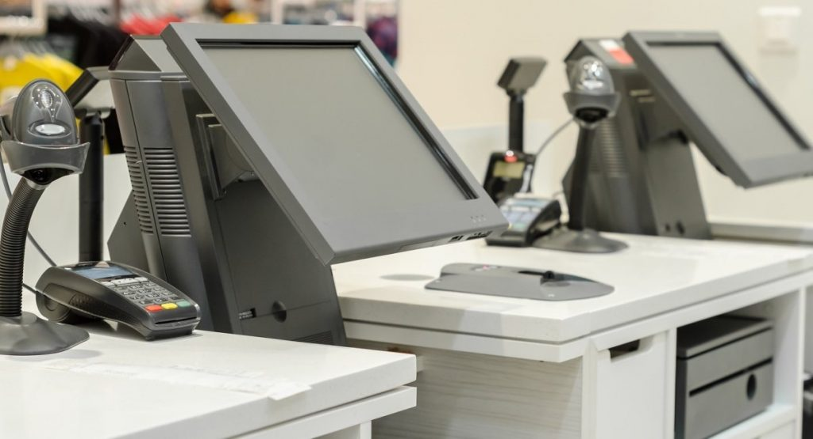
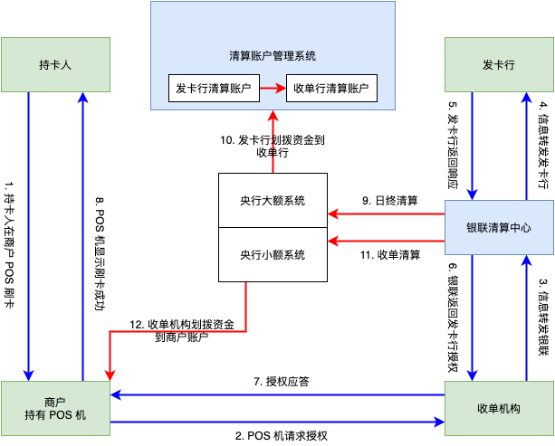

POS 的英文是 Point of Sales，字面意思是销售点，百度百科也说是“销售点情报管理系统”，本质上来说，是一套系统，有很多的组成部分。

POS 系统

这套系统，大家见得比较多，主要用于零售点的收银，是零售业门店管理的重要组成部分。

这里面融合了库存，价格，收银，出纳等等功能。基本原理是这样的，门店的商品和信息被录入到系统中，然后需要一个条码读取器，可以扫描商品，统计订单金额，然后生成收银请求，配合银行卡读卡器，完成交易（无现金），也可以弹出一个抽屉，完成现金交易的收钱，找零等。

不过，咱们一般提到 POS 机，指的都是桌上那个小东西，就是 POS 刷卡机。因为这个东西能够从银行卡进行扣款转账，是一次销售行为中最重要的部分，所以刷卡机就往往被称作是 POS 机了。当然，众所周知的，也可以脱离开这个场景使用 :) 具体用途就不解释了。

POS 刷卡机，简称 POS 机，背后对应的业务，专业上叫银行卡线下收单业务。主要是银行类机构，以及第三方支付公司（又称非金融机构）经营的业务。对银行来说，不是主要的业务，但是对第三方支付公司来说，是主要经营的一种业务。

POS 机的持有者，专业上叫特约商户，一般来说，是一个零售型企业。他们为什么要安装 POS 机呢？主要是因为顾客是上帝，顾客更喜欢使用 POS 机进行支付。顾客在专业上叫持卡人，主要持有银行机构发行的储蓄卡，信用卡。银行机构，在这个场景里，叫发卡行。POS 机的作用就是从发卡行发行的卡账户上，将资金扣转并转移到特约商户的账户上。

如果，持卡人持有的卡，不是本行发行的卡，那么需要通过跨行结算组织，完成跨行资金结算，这个跨行结算组织，就是银联。

对于银行来说，去对接海量的线下零售型商户，显然是一个低效益并且也不可能完成的任务，所以，更多的 POS 线下收单业务，都由第三方支付公司经营。第三方支付公司，需要持有经营此项业务的牌照，也就是支付牌照。

对于第三方支付公司来说，经营 POS 线下收单业务，是其特许经营的业务，需要处理好与各种银行机构或者清算组织的业务，以及保障好交易的安全。拓展线下商户的任务，对其来说，是一个低效益的事情。所以，这里又出现了一个角色，就是代理商。

代理商的主要业务是，拓展线下商户，安装和部署 POS 机，维护客户的关系。代理商公司，不具备经营线下收单业务的资格，也即没有支付牌照。所以，其业务得以开展，主要还是依托支付公司的牌照。通过通信技术和计算机系统，完成与支付公司的对接，并在自己的信息系统上管理海量的特约商户客户。

因为涉及到跟清算组织的连接，所以，第三方支付公司的结算，也要符合清算组织的规则，所以，往往，POS 机都是 T+1 结算的。这主要受限于银联的业务规则。当然，这体验不好。于是，代理商公司为了优化自己客户的体验，就想出一个办法，自己设立一家特约商户，然后，生产很多 POS 机，然后把这个 POS 机分发给自己的客户商户，这样客户商户不需要跟支付公司签约，支付给每个商户的钱，都会支付给代理商公司，这个代理商公司再根据每个订单，把钱分给客户商户。这个过程就叫做“二清”，是二次清分的意思。

在二清的场景下，第三方支付公司会把所有的订单支付都结算给代理商公司，然后代理商公司再次把钱分给底下的商户。这里，如果代理商公司，垫付一笔资金，就可以先行将资金垫付给商户，然后等 T+1 的时候，支付公司自然会结算这笔钱。这就优化了客户的体验。

当然，这里存在巨大的安全隐患，如果代理商公司不给客户商户结算，自己拿着支付公司结算的款项跑路，这就带来了巨大的风险。所以，二清是不合规的。对于特约商户来说，如果安装使用了二清的 POS 机也是有巨大的风险的。

使用 POS 机进行收款，是需要支付手续费的。手续费的主要分成方是发卡行，银联，第三方支付公司，以及代理商。手续费的费率是不一样的，到了特约商户这里，可能各不相同。就是因为这里面，第三方支付公司，或者代理商有一定的费用融合在里面，尤其是代理商，其不是金融机构，不接受监管。费用的设置，主要是依赖市场竞争来调节。所以特约商户拿到的 POS 机费率各不相同。各个行业也有不同，一般消费类的场景，现在的行情是 0.6% 左右，如果特别低，可能存在猫腻。

以上知识，主要来自搜索、知乎，不确保准确无误。下面附上一幅图解释一次 POS 机刷卡的业务流程，原图来自网络，不清楚，进行了重绘。

一次完整的POS机刷卡流程

上图中，蓝色的线条代表信息流，红色的线条代表资金流。绿色的是参与方。收单行，也叫收单机构，可以是银行，也可以是第三方支付公司。商户在收单机构处开设有结算账户。如果收单机构是银行，则结算账户本身就是银行账户，但是也极可能是专用的。如果是第三方支付公司，则结算账户可能是某种虚拟账户，在第三方支付公司的托管系统中。从结算账户到商户的一般企业账户，可能还需要一次提现，在图中都被省略。

图中清算账户管理系统是个比较神秘的系统，我猜可能是银联这样的清算组织管理各方结算账户的系统。值得一提的是，这个图里说明，从收单行进行大额清算结束后，再把钱清算到商户的账户，使用的是央行小额系统完成的。对这一点，并没有进一步的信息以印证，大家就看个意思就行了。